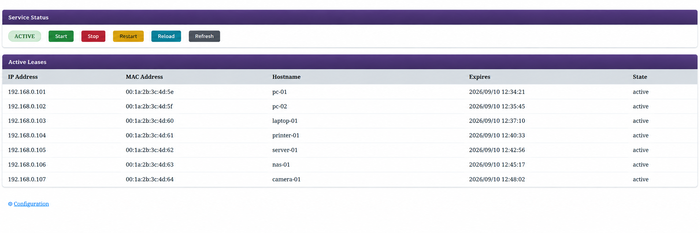

# [PyDHCP](https://github.com/maravento)

[](https://github.com/maravento/pydhcp)
[](https://github.com/maravento/pydhcp)
[](https://github.com/maravento/pydhcp/stargazers)
[](https://twitter.com/maraventostudio)

<!-- markdownlint-disable MD033 -->

<table>
  <tr>
    <td style="width: 50%; vertical-align: top;">
      <b>PyDHCP</b> is an open-source IPv4 DHCP server written in Python. <br>
      <br>
      <a href="https://github.com/isc-projects/dhcp">isc-dhcp-server</a> reached end of life in 2022. PyDHCP keeps several of its features and a similar configuration style, which can make migration easier. It covers common use cases but does not replace every isc-dhcp-server feature. <br>
      <br>
      PyDHCP implements DHCP under RFC 2131 over UDP ports 67 and 68. It uses a similar configuration syntax and lease-file format, with its own file paths. It runs as a <code>systemd</code> service. The legacy <code>/etc/init.d/pydhcpd</code> script is a compatibility interface for the <code>service</code> command; when systemd is active, it delegates actions to <code>systemctl</code> rather than starting a separate daemon.
    </td>
    <td style="width: 50%; vertical-align: top;">
      <b>PyDHCP</b> es un servidor DHCP IPv4 de código abierto escrito en Python. <br>
      <br>
      <a href="https://github.com/isc-projects/dhcp">isc-dhcp-server</a> llegó al fin de su ciclo de vida en 2022. PyDHCP conserva varias de sus funciones y una sintaxis de configuración similar, lo que puede facilitar la migración. Cubre usos comunes, pero no reemplaza todas las funciones de isc-dhcp-server. <br>
      <br>
      PyDHCP implementa DHCP según la RFC 2131 sobre los puertos UDP 67 y 68. Usa una sintaxis de configuración y un formato de archivo de concesiones similares, con rutas propias. Funciona como servicio de <code>systemd</code>. El script heredado <code>/etc/init.d/pydhcpd</code> ofrece compatibilidad con el comando <code>service</code>; cuando systemd está activo, delega las acciones en <code>systemctl</code> en lugar de iniciar otro daemon.
    </td>
  </tr>
</table>

## REQUIREMENTS

---

**⚠️ WARNING:** Tested on Ubuntu 24.04 / 26.04 LTS. Use on other versions or distributions is at your own risk.  
**⚠️ ADVERTENCIA:** Probado en Ubuntu 24.04 / 26.04 LTS. El uso en otras versiones o distribuciones queda bajo responsabilidad de quien lo instale.

- Python 3.8+
- systemd
- iproute2, passwd, util-linux, coreutils, grep, sed, iputils-ping, findutils, libc-bin, logrotate

## HOW TO USE

---

### Install

<table>
  <tr>
    <td style="width: 50%; vertical-align: top;">
      PyDHCP is installed by cloning the repository and running the installer, which copies the files to their corresponding system paths:
    </td>
    <td style="width: 50%; vertical-align: top;">
      Para instalar PyDHCP, se clona el repositorio y se ejecuta el instalador, que copia los archivos en las rutas correspondientes del sistema:
    </td>
  </tr>
</table>

```bash
git clone --depth=1 https://github.com/maravento/pydhcp.git
cd pydhcp
sudo bash pysetup.sh
```

### Update & Remove

<table>
  <tr>
    <td style="width: 50%; vertical-align: top;">
      To update or remove PyDHCP, clone the repository and run the command from its directory:
    </td>
    <td style="width: 50%; vertical-align: top;">
      Para actualizar o desinstalar PyDHCP, se clona el repositorio y, desde su directorio, se ejecuta:
    </td>
  </tr>
</table>

```bash
cd pydhcp
sudo bash pysetup.sh --update
# or
sudo bash pysetup.sh --remove
```

| File | `--update` | `--remove` |
|------|-----------|------------|
| `pydhcpd.py` | ✅ overwritten | ✅ removed |
| `pydhcpd.service` | ✅ overwritten | ✅ removed |
| `init.d/pydhcpd` | ✅ overwritten | ✅ removed |
| `tools/pybk.sh` | ✅ overwritten | ✅ removed (its cron entry is deregistered first) |
| `tools/pyleases.sh` | ✅ overwritten | ✅ removed |
| `tools/pywebmin.sh` | ✅ overwritten | ✅ removed (also uninstalls the Webmin module, if installed) |
| `pydhcpd.conf` | ⛔ preserved | ✅ removed |
| `pydhcpd.leases` | ⛔ preserved | ✅ removed |
| `pydhcp.env` | ⛔ preserved | ✅ removed |
| `/var/log/pydhcp.log` (shared by the daemon, `pysetup.sh` and `tools/pyleases.sh`) | ⛔ preserved | ✅ removed |
| `/etc/logrotate.d/pydhcp` | ⛔ preserved | ✅ removed |
| system user/group `pydhcpd` | ⛔ preserved | ✅ removed |
| `acl/blockdhcp.txt` (pydhcp's own block list) | ⛔ preserved | ✅ removed |
| `core/pydhcpd.conf.bak`, `core/pydhcpd.conf.webmin.bak` (rollback copies) | ⛔ preserved | ✅ removed |
| `/etc/bak/` (project backups written by `tools/pybk.sh`) | ⛔ preserved | ⛔ preserved |
| `/etc/acl/mac/` (administrator's own ACL lists) | ⛔ preserved | ⛔ preserved |

> `/etc/acl` is never touched by `--remove`. It holds the administrator's own `mac-*.txt` lists, edited by hand, which `pydhcp` may or may not use depending on whether the optional `tools/pyleases.sh` tool is ever run — `pysetup.sh` creates the directory regardless, so uninstalling the daemon does not assume that data is safe to discard.
>
> `/etc/acl` permanece intacto al ejecutar `--remove`. Allí se guardan las listas `mac-*.txt` del administrador. `pydhcp` solo las utiliza si se ejecuta la herramienta opcional `tools/pyleases.sh`. Como `pysetup.sh` crea ese directorio, la desinstalación no elimina esos datos.

> `blockdhcp.txt` is a different case: it is `pydhcp`'s own list, written only by `pyleases.sh` and not edited manually. It is therefore stored under `/etc/pydhcp/acl/`, like `uhm`'s own lists under `/etc/uhm/acl/`. The `--remove` option deletes it along with the rest of `/etc/pydhcp`; to keep a copy, run `tools/pybk.sh` first.
>
> `blockdhcp.txt` es un caso distinto: es la lista propia de `pydhcp`, escrita solo por `pyleases.sh` y no se edita manualmente. Por eso se guarda en `/etc/pydhcp/acl/`, igual que las listas propias de `uhm` se guardan en `/etc/uhm/acl/`. La opción `--remove` la elimina junto con el resto de `/etc/pydhcp`; para conservar una copia, se ejecuta antes `tools/pybk.sh`.

### Daily operation

---

```bash
# Edit main config | Editar configuración principal
sudo nano /etc/pydhcp/core/pydhcpd.conf

# Restart service | Reiniciar servicio
sudo systemctl restart pydhcpd

# Check status | Verificar estado
sudo systemctl status pydhcpd
# ● pydhcpd.service - pydhcpd - Python DHCP Daemon
#      Loaded: loaded (/etc/systemd/system/pydhcpd.service; enabled; preset: enabled)
#      Active: active (running) since Tue 2026-06-09 17:51:49 -05; 17s ago
#        Docs: https://github.com/maravento/pydhcp
#    Main PID: 2356158 (python3)
#       Tasks: 3 (limit: 76240)
#      Memory: 11.0M (peak: 11.6M)
#         CPU: 331ms
#      CGroup: /system.slice/pydhcpd.service
#              └─2356158 /usr/bin/python3 /etc/pydhcp/core/pydhcpd.py
# jun 09 17:51:49 host systemd[1]: Started pydhcpd.service - pydhcpd - Python DHCP Daemon.
# jun 09 17:51:49 host python3[1411247]: 2026-06-09 17:51:49,068 INFO: Attached BPF filter to raw socket (dst port 67)
# jun 09 17:51:49 host python3[1449863]: 2026-06-09 16:20:31,317 INFO: Config loaded: 158 hosts, 208 blocked
# jun 09 17:51:49 host python3[1449863]: 2026-06-09 16:20:31,323 INFO: Leases loaded: 2 entries
# jun 09 17:51:49 host python3[1411247]: 2026-06-09 17:51:49,068 INFO: Listening on enpXsX (DHCP port 67)

# Other entries...
# jun 09 17:51:49 host python3[2356158]: 2026-06-09 17:51:49,071 INFO: pydhcpd started (pid 2356158)
# jun 09 17:51:49 host python3[2356158]: 2026-06-09 17:51:49,071 INFO: interface enpXsX
# jun 09 17:51:49 host python3[2356158]: 2026-06-09 17:51:49,072 INFO: Listening on enpXsX (DHCP port 67)
# jun 09 17:51:52 host python3[2356158]: 2026-06-09 17:51:52,316 INFO: DISCOVER from aa:bb:cc:dd:ee:ff (FooBar)
# jun 09 17:51:52 host python3[2356158]: 2026-06-09 17:51:52,316 INFO: Blocked aa:bb:cc:dd:ee:ff -- skip
# jun 09 17:52:02 host python3[2356158]: 2026-06-09 17:52:02,086 INFO: DISCOVER from bb:cc:dd:ee:ff:aa (<no hostname>)
# jun 09 17:52:02 host python3[2356158]: 2026-06-09 17:52:02,154 INFO: OFFER bb:cc:dd:ee:ff:aa → 192.168.0.231
# jun 09 17:52:02 host python3[2356158]: 2026-06-09 17:52:02,264 INFO: REQUEST from bb:cc:dd:ee:ff:aa (<no hostname>)
# jun 09 17:52:02 host python3[2356158]: 2026-06-09 17:52:02,283 INFO: ACK bb:cc:dd:ee:ff:aa → 192.168.0.231
# jun 09 17:52:02 host python3[2356158]: 2026-06-09 17:52:02,283 INFO: (lease 60s)
# jun 09 17:52:15 host python3[2356158]: 2026-06-09 17:52:15,391 INFO: DISCOVER from cc:dd:ee:ff:aa:bb (BazHost)
# jun 09 17:52:15 host python3[2356158]: 2026-06-09 17:52:15,391 INFO: No IP for cc:dd:ee:ff:aa:bb -- skip
# jun 09 17:53:02 host python3[2356158]: 2026-06-09 17:53:02,173 INFO: Lease expired: 192.168.0.230

# View active leases | Ver concesiones activas
cat /etc/pydhcp/core/pydhcpd.leases

# Reload config without restart (SIGHUP) | Recargar configuración sin reiniciar (SIGHUP)
sudo systemctl reload pydhcpd

# Test configuration syntax without starting the daemon (-t [-cf FILE])
sudo /etc/pydhcp/core/pydhcpd.py --test
sudo /etc/pydhcp/core/pydhcpd.py -t -cf /path/to/alternate.conf

# View logs (journald) | Ver logs (journald)
sudo journalctl -u pydhcpd -f

# View logs (file) | Ver logs (archivo)
sudo tail -f /var/log/pydhcp.log
```

### Config

<table>
  <tr>
    <td style="width: 50%; vertical-align: top;">
      During installation, the setup wizard asks for the interface, server address, subnet, address range and DNS servers. Afterward, <code>pydhcpd.conf</code> can be edited to add static host reservations or other directives. The service must be restarted to apply those changes.
    </td>
    <td style="width: 50%; vertical-align: top;">
      Durante la instalación, el asistente solicita la interfaz, la dirección del servidor, la subred, el rango de direcciones y los servidores DNS. Después, <code>pydhcpd.conf</code> puede editarse para añadir reservas estáticas u otras directivas. Para aplicar esos cambios, se reinicia el servicio.
    </td>
  </tr>
</table>

| File | Description | Descripción |
|-------------|-------------|------|
| `/etc/pydhcp/core/pydhcpd.conf` | Main configuration file | Archivo de configuración principal |
| `/etc/pydhcp/core/pydhcpd.leases` | Active leases database | Base de datos de concesiones activas |
| `/etc/pydhcp/pydhcp.env` | Shared settings: daemon paths, interface, user/group, network values, ACL paths, lease timers and WPAD/ping-check flags. `pysetup.sh` creates the file during installation; `tools/pyleases.sh` reads its required keys and stops if one is missing or invalid (see Key check) | Configuración compartida: rutas del daemon, interfaz, usuario/grupo, valores de red, rutas ACL, duración de las concesiones y opciones de WPAD/ping-check. `pysetup.sh` crea el archivo durante la instalación; `tools/pyleases.sh` lee las claves que necesita y se detiene si falta alguna o no es válida (ver Key check) |
| `/etc/systemd/system/pydhcpd.service` | systemd unit | Unidad systemd |
| `/etc/init.d/pydhcpd` | Legacy compatibility script for the `service` command; delegates to systemd when active | Script heredado compatible con `service`; delega en systemd cuando está activo |

#### pydhcp.env — daemon bootstrap

<table width="100%">
  <tr>
    <td style="width: 50%; vertical-align: top;">
      <code>pydhcp.env</code> holds only bootstrap values -- paths, the interface, and the daemon's user/group -- read once by <code>pydhcpd.py</code> at startup. Every lease timer, <code>ping-check</code>, <code>ping-timeout</code>, <code>abandon-lease-time</code>, WPAD and static host/block-list entry is a <code>pydhcpd.conf</code> directive, never a <code>pydhcp.env</code> key.
    </td>
    <td style="width: 50%; vertical-align: top;">
      <code>pydhcp.env</code> contiene los valores que <code>pydhcpd.py</code> necesita al iniciar, como las rutas, la interfaz y el usuario/grupo. El daemon los lee una vez al arrancar. Los temporizadores de concesión y las opciones <code>ping-check</code>, <code>ping-timeout</code>, <code>abandon-lease-time</code> y WPAD se configuran en <code>pydhcpd.conf</code>, no en <code>pydhcp.env</code>.
    </td>
  </tr>
</table>

| Variable | Description | Descripción |
|----------|--------------|-------------|
| `INTERFACESv4` | Interface `pydhcpd.py` listens on | Interfaz en la que escucha `pydhcpd.py` |
| `DAEMON_USER`, `DAEMON_GROUP` | Owner the daemon sets on the leases file it rewrites. The process itself is started already unprivileged by `pydhcpd.service`, so it never drops privileges | Propietario que el demonio pone al archivo de concesiones que reescribe. El proceso lo arranca ya sin privilegios `pydhcpd.service`, así que nunca baja de privilegios |
| `DHCPDv4_CONF` | Path to `pydhcpd.conf`, read at startup and on `SIGHUP`/`reload` | Ruta a `pydhcpd.conf`, leída al arrancar y en `SIGHUP`/`reload` |
| `DHCPDv4_BIN`, `DHCPDv4_SCRIPT` | Python interpreter and daemon script path, used by `init.d/pydhcpd` and `pywebmin.sh` to invoke `pydhcpd.py` for config tests | Intérprete Python y ruta del script del demonio, usados por `init.d/pydhcpd` y `pywebmin.sh` para invocar `pydhcpd.py` en las pruebas de configuración |
| `PYDHCPD_LEASES` | Leases database path | Ruta de la base de datos de leases |

#### pydhcp.env — pydhcp-only extras

<table width="100%">
  <tr>
    <td style="width: 50%; vertical-align: top;">
      A second group in <code>pydhcp.env</code>, distinct from the previous one: features with no <code>pydhcpd.conf</code> directive behind them. There is nothing to keep in sync with a <code>pydhcpd.conf</code> template. <br>
      <br>
      <code>pydhcpd.py</code> reads them directly from <code>pydhcp.env</code> at startup, the same way it reads the bootstrap group above. <code>pyleases.sh</code> never touches them: it only builds <code>pydhcpd.conf</code>, and these values are not directives of that file.
    </td>
    <td style="width: 50%; vertical-align: top;">
      <code>pydhcp.env</code> también contiene opciones propias de PyDHCP que no tienen una directiva equivalente en <code>pydhcpd.conf</code>. <code>pydhcpd.py</code> las lee directamente al arrancar. <code>pyleases.sh</code> no las modifica: solo genera <code>pydhcpd.conf</code>.
    </td>
  </tr>
</table>

| Variable | Description | Descripción |
|----------|--------------|-------------|
| `PING_CACHE_TTL_SECONDS` | Seconds a `ping-check` result (alive/dead) is cached before re-checking the same IP; default `120` | Segundos durante los que se conserva en caché el resultado de `ping-check` (activa/inactiva) antes de volver a comprobar la IP; valor predeterminado: `120` |
| `RATE_LIMIT_WINDOW_SECONDS`, `RATE_LIMIT_MAX` | Anti-abuse throttle: at most `RATE_LIMIT_MAX` new lease allocations per MAC within `RATE_LIMIT_WINDOW_SECONDS`, to limit pool exhaustion by an attacker rotating MACs; defaults `60`/`5` | Límite contra abusos: permite como máximo `RATE_LIMIT_MAX` nuevas concesiones por MAC durante `RATE_LIMIT_WINDOW_SECONDS`, para dificultar que un atacante agote el grupo de direcciones al rotar las MAC; valores predeterminados: `60` y `5` |
| `RESERVATION_TTL_SECONDS` | Seconds a DISCOVER-only provisional reservation holds an IP before expiring, if no matching REQUEST follows; default `30` | Segundos durante los que una solicitud `DISCOVER` puede reservar provisionalmente una IP si no llega el `REQUEST` correspondiente; valor predeterminado: `30` |

All four values above must be at least `1`. A value below `1` (for example `RATE_LIMIT_MAX=0`, which does not mean "unlimited") is rejected with a `WARNING` in the log and the default is used instead.

Los cuatro valores anteriores deben ser como mínimo `1`. Un valor menor que `1` (por ejemplo, `RATE_LIMIT_MAX=0`, que no significa «sin límite») se rechaza con una advertencia (`WARNING`) en el registro y se usa el valor predeterminado.

#### pydhcp.env — pyleases.sh automation input (mirrors dhcpd.conf directives)

<table width="100%">
  <tr>
    <td style="width: 50%; vertical-align: top;">
      A third group in <code>pydhcp.env</code>, distinct from the two above: input values for the optional automation layer of <code>pyleases.sh</code>. <br>
      <br>
      Unlike the bootstrap group, <code>pydhcpd.py</code> never reads them directly. <code>pysetup.sh</code> creates them and <code>pyleases.sh</code> writes the corresponding directive into <code>pydhcpd.conf</code> on every run. See Supported directives. A bare install managed by hand never needs them. <br>
      <br>
      <code>pyleases.sh</code> never writes a key into the file. It checks the keys it consumes and aborts if one is wrong. See Key check.
    </td>
    <td style="width: 50%; vertical-align: top;">
      <code>pydhcp.env</code> incluye valores que <code>pyleases.sh</code> utiliza para generar directivas de <code>pydhcpd.conf</code>. <code>pysetup.sh</code> crea estas claves y <code>pyleases.sh</code> las lee en cada ejecución, pero no las modifica. Este grupo no es necesario si la instalación se administra sin <code>pyleases.sh</code>. La información ampliada está en las secciones «Directivas compatibles» y «Comprobación de claves».
    </td>
  </tr>
</table>

| Variable | `pydhcpd.conf` directive it becomes | Description | Descripción |
|----------|--------------------------------------|--------------|-------------|
| `CLEANUP_INTERVAL` | `cleanup-interval` | Pool cleanup frequency in seconds; default `60` | Frecuencia de limpieza del pool en segundos; default `60` |
| `AUTHORIZED_LEASE_TIME` | subnet `min`/`default`/`max-lease-time` | Lease duration for authorized/static clients in seconds; default `2592000` (30 days) | Duración del lease para clientes autorizados/estáticos en segundos; default `2592000` (30 días) |
| `QUARANTINE_DURATION` | `abandon-lease-time` | See "IP quarantine" in Operational Details below; default `60` | Ver "IP quarantine" en Operational Details abajo; default `60` |
| `WPAD_ENABLED` | `option wpad ...;` | See WPAD/PAC via DHCP option 252 below; default `false` | Ver WPAD/PAC via DHCP option 252 abajo; default `false` |
| `WPAD_PORT` | port inside the `option wpad ...;` URL | TCP port of the Apache VirtualHost serving `wpad.pac`; fixed at `18100` by `pysetup.sh`, not prompted for. WPAD itself is auto-detected at install time by probing `wpad.pac` on that port, not asked interactively | Puerto TCP del VirtualHost de Apache que sirve `wpad.pac`; fijado en `18100` por `pysetup.sh`, no se pregunta. WPAD mismo se autodetecta durante la instalación probando `wpad.pac` en ese puerto, no se pregunta de forma interactiva |
| `PING_CHECK_ENABLED` | `ping-check` | See "ping-check" in Operational Details below; default `true` | Ver "ping-check" en Operational Details abajo; default `true` |
| `PING_TIMEOUT_SECONDS` | `ping-timeout` | See "ping-check" in Operational Details below; default `1` | Ver "ping-check" en Operational Details abajo; default `1` |
| `SERVER_IP` | `server-identifier`, `option routers` | Server's own IPv4 on the LAN interface | IPv4 del servidor en la interfaz LAN |
| `SERV_SUBNET`, `SERV_MASK` | `subnet ... netmask ...` | Network address and netmask of the LAN subnet | Dirección de red y máscara de la subred LAN |
| `SERV_BROADCAST` | `option broadcast-address` | Broadcast address of the LAN subnet | Dirección de broadcast de la subred LAN |
| `SERV_DNS` | `option domain-name-servers` | DNS servers handed to clients; accepts a comma-separated list | Servidores DNS que se entregan a los clientes; admite una lista separada por comas |
| `SERV_INI_RANGE_BLOCK`, `SERV_END_RANGE_BLOCK` | `range` of the block pool | First and last IPv4 of the pool reserved for clients that are not on a MAC list | Primera y última IPv4 del pool reservado para los clientes que no están en una lista MAC |
| `ACL_MAC_PATH`, `ACL_MAC_LIMITED`, `ACL_MAC_UNLIMITED` | `host` entries | Directory and files holding the administrator's MAC lists. `pyleases.sh` reads every `mac-*.txt` in that directory, not only those two files | Directorio y archivos con las listas MAC del administrador. `pyleases.sh` lee todos los `mac-*.txt` del directorio, no solo esos dos archivos |
| `ACL_DHCP_PATH`, `ACL_BLOCK_FILE` | `class blockdhcp` members | Directory and file holding pydhcp's own blocked-MAC list, written by `pyleases.sh` | Directorio y archivo con la lista de MAC bloqueadas propia de pydhcp, escrita por `pyleases.sh` |

Every key in this table is verified by `pyleases.sh` before it rewrites `pydhcpd.conf`. `SERVER_IP`, `SERV_SUBNET`, `SERV_BROADCAST`, `SERV_INI_RANGE_BLOCK` and `SERV_END_RANGE_BLOCK` must parse as an IPv4 address, `SERV_MASK` as a netmask and `SERV_DNS` as an IPv4 list. See Key check.

Todas las claves de esta tabla las verifica `pyleases.sh` antes de reescribir `pydhcpd.conf`. `SERVER_IP`, `SERV_SUBNET`, `SERV_BROADCAST`, `SERV_INI_RANGE_BLOCK` y `SERV_END_RANGE_BLOCK` deben ser direcciones IPv4 válidas, `SERV_MASK` una máscara y `SERV_DNS` una lista de IPv4. Ver «Key check».

#### pydhcp.env — shared (not used by pydhcp itself)

<table width="100%">
  <tr>
    <td style="width: 50%; vertical-align: top;">
      A fourth group in <code>pydhcp.env</code>: values pydhcp itself never reads, hosted here only because pydhcp.env is the one file every project on this host already reads. A project that also depends on pydhcp can read its own key from here instead of asking the same question again or hardcoding it. <br>
      <br>
      <code>pysetup.sh</code> creates the two keys below during installation. A project that needs a further shared key adds it here the first time it runs, and any project running after it reuses the existing value instead of asking again.
    </td>
    <td style="width: 50%; vertical-align: top;">
      El último grupo contiene valores que PyDHCP no utiliza, pero que otros proyectos pueden compartir desde <code>pydhcp.env</code>. Así, esos proyectos pueden leer aquí su configuración en lugar de volver a solicitarla o escribirla directamente en el código. <br>
      <br>
      <code>pysetup.sh</code> crea las dos claves de abajo durante la instalación. El proyecto que necesite otra clave compartida la añade; los demás proyectos pueden reutilizarla.
    </td>
  </tr>
</table>

| Variable | Description | Descripción |
|----------|--------------|-------------|
| `ACL_PATH` | Parent directory of the ACL tree, `ACL_MAC_PATH` and `ACL_DHCP_PATH` hang from it. No pydhcp script reads it; it is written so other projects sharing `/etc/acl` can read the base path | Directorio padre del árbol de ACL, del que cuelgan `ACL_MAC_PATH` y `ACL_DHCP_PATH`. Ningún script de pydhcp la lee; se escribe para que otros proyectos que comparten `/etc/acl` lean la ruta base |
| `WAN_IFACE` | Name of the host's WAN network interface. Not used by pydhcp; added to the `.env` to share it with other projects that also use pydhcp | Nombre de la interfaz de red WAN del host. No es utilizada por pydhcp; se agrega al entorno `.env` para compartirla con otros proyectos que utilizan pydhcp |

#### Fixed values (not configurable anywhere)

<table width="100%">
  <tr>
    <td style="width: 50%; vertical-align: top;">
      <code>pydhcp.env</code> holds only real values that the administrator can adjust: the two groups above, plus the bootstrap group and the <code>pyleases.sh</code> input group described earlier. <br>
      <br>
      A handful of internal constants of <code>pydhcpd.py</code> are deliberately left out of <code>pydhcp.env</code> and of <code>pydhcpd.conf</code>. Each one is a protocol or arithmetic invariant, or an internal implementation detail with no meaningful range of alternatives for the administrator. None of them is an operational choice:
    </td>
    <td style="width: 50%; vertical-align: top;">
      <code>pydhcp.env</code> contiene solo valores reales que el administrador puede ajustar: los dos grupos de arriba, más el grupo de arranque y el de entrada de <code>pyleases.sh</code> descritos antes. <br>
      <br>
      Los valores de esta tabla son constantes internas de <code>pydhcpd.py</code>; no se pueden cambiar desde <code>pydhcp.env</code> ni desde <code>pydhcpd.conf</code>. Algunos reflejan límites del protocolo y otros forman parte de la implementación del daemon. No son opciones de configuración para administrar el servicio:
    </td>
  </tr>
</table>

| Value | Why it's fixed | Por qué es fijo |
|-------|-----------------|-------------------|
| Max pool size (`65,536` addresses) | Fixed limit imposed by PyDHCP to bound memory and CPU use; not an IPv4 limit. Larger pools are rejected at config load or reload | Tope impuesto por PyDHCP para limitar el uso de memoria y CPU; no es un límite de IPv4. El daemon rechaza pools mayores al cargar o recargar la configuración |
| Max DHCP option length (`255` bytes -- WPAD URL and other option values) | Fixed by the 1-byte length field in the DHCP option format (RFC 2132); there's no larger value the protocol can even represent | Fijado por el campo de longitud de 1 byte del formato de opción DHCP (RFC 2132); no hay un valor mayor que el protocolo pueda siquiera representar |
| Allocation round-robin counter wraparound (`2**16`) | Internal iteration state with no observable effect on behavior -- changing it doesn't change what the daemon does | Contador interno que participa en la selección de direcciones; su valor no se configura en los archivos de PyDHCP |
| Main-loop shutdown poll timeout (`5`s socket timeout) | Controls how fast a `systemctl stop` is noticed, not DHCP behavior (leases, OFFERs, etc.) | Determina cada cuánto el daemon comprueba si debe detenerse; no cambia la asignación de direcciones ni la duración de las concesiones |

### File Ownership and Permissions

<table>
  <tr>
    <td style="width: 50%; vertical-align: top;">
      The daemon runs as the system account <code>pydhcpd</code>, not as root. <code>pydhcpd.service</code> grants it two kernel capabilities: <code>CAP_NET_RAW</code>, for the raw socket and the ICMP ping check, and <code>CAP_NET_BIND_SERVICE</code>, to bind port 67. No other capability is needed or granted. <br>
      <br>
      Ownership is therefore assigned according to what the daemon does with each file, not uniformly. <code>pysetup.sh</code> sets these values on purpose, and the table documents the reasoning. <br>
      <br>
      The values are also enforced afterwards. On every run, <code>tools/pyleases.sh</code> checks <code>pydhcp.env</code>, <code>pydhcpd.conf</code>, <code>pydhcpd.leases</code>, the ACL lists and <code>/var/log/pydhcp.log</code>. If any owner or mode was changed, it restores exactly these values and logs a <code>WARNING</code>.
    </td>
    <td style="width: 50%; vertical-align: top;">
      El servicio se ejecuta con la cuenta del sistema <code>pydhcpd</code>, no como <code>root</code>. La unidad <code>pydhcpd.service</code> le concede dos capacidades del kernel: <code>CAP_NET_RAW</code>, para el socket raw y la comprobación ICMP; y <code>CAP_NET_BIND_SERVICE</code>, para usar el puerto 67. No necesita otras capacidades. <br>
      <br>
      <code>pysetup.sh</code> asigna propietarios y permisos según la función de cada archivo. La tabla explica esos valores. <br>
      <br>
      En cada ejecución, <code>tools/pyleases.sh</code> también revisa los propietarios y permisos de <code>pydhcp.env</code>, <code>pydhcpd.conf</code>, <code>pydhcpd.leases</code>, las listas ACL y <code>/var/log/pydhcp.log</code>. Si detecta cambios, restablece los valores de la tabla y registra una advertencia (<code>WARNING</code>).
    </td>
  </tr>
</table>

| Path | Owner | Mode | What the daemon does | Why |
|------|-------|------|----------------------|-----|
| `/etc/pydhcp` | `root:pydhcpd` | `770` | creates, renames and deletes entries | **Others get nothing** — no other account on the system can even enter the directory. Group `w` is the minimum that works: the daemon creates a temp file and `os.replace()`s it over the leases file, and creates and removes its PID file. `750` breaks all four operations. The group has exactly one member: the daemon's own service account (shell `/bin/false`, no home, no supplementary groups). **No sticky bit** — see the note below |
| `pydhcpd.py` | `root:root` | `755` | reads and executes | Root-owned so the daemon cannot modify the code it is running. `/etc/pydhcp` being `770` already blocks every other account, so the `others` bits are what the daemon reads through |
| `pydhcpd.conf` | `root:pydhcpd` | `640` | reads | Read through the group. Root-owned so a compromised daemon cannot rewrite its own configuration |
| `pydhcp.env` | `root:pydhcpd` | `640` | reads | Same as above. `640` keeps it out of reach of other users |
| `pydhcpd.leases` | `pydhcpd:pydhcpd` | `640` | replaces atomically | Daemon-owned because the daemon writes it: the atomic replace creates a new file and renames it over this one, so the result carries the writer's ownership |
| `pydhcpd.conf.bak` | `root:root` | `640` | never touches it | Single rollback copy written by `tools/pyleases.sh` before it regenerates the config, and restored automatically if the daemon then fails to start. Created with `cp`, which preserves the source's `640` |
| `pydhcpd.conf.webmin.bak` | `root:root` | `640` | never touches it | Single rollback copy written by the Webmin module (`tools/pywebmin.sh`) before each save from the browser editor. Kept under its own name, not `pydhcpd.conf.bak`, so the two never overwrite each other: that one belongs to `pyleases.sh`/`uhmleases.sh` and undoes an automatic rebuild, this one undoes a manual edit. Perl's `File::Copy` does not preserve the source mode, so `config.cgi` applies `chmod 0640` explicitly — otherwise the backup would land at whatever root's umask dictates and end up more permissive than the config it copies |
| `/var/log/pydhcp.log` | `pydhcpd:pydhcpd` | `640` | appends | Daemon-owned so it can write. `pysetup.sh` and `tools/pyleases.sh` also write to it, but they run as root |
| `tools/` | `root:root` | `755` | never touches it | Run manually by root; not part of the daemon's runtime |
| `pydhcpd.service` | `root:root` | `644` | — | Belongs to systemd |
| `/etc/init.d/pydhcpd` | `root:root` | `755` | — | Belongs to sysvinit |
| `/etc/logrotate.d/pydhcp` | `root:root` | `644` | — | logrotate ignores configuration files not owned by root |

> **⚠️ WARNING:** Do not "unify" these into a single owner. Making everything `pydhcpd:pydhcpd` would hand the directory to the daemon, which could then replace any entry in it, including its own code. Making everything `root:pydhcpd` would break the leases and PID files, whose atomic replace and removal require ownership, and would need `CAP_FOWNER` to work around.
>
> **⚠️ WARNING:** No "unifique" esto en un solo propietario. Poner todo en `pydhcpd:pydhcpd` le entregaría el directorio al demonio, que podría entonces reemplazar cualquier entrada, incluido su propio código. Poner todo en `root:pydhcpd` rompería los archivos de concesiones y PID, cuyo reemplazo atómico y borrado exigen ser propietario, y requeriría `CAP_FOWNER` para sortearlo.

> **⚠️ WARNING: why `/etc/pydhcp` carries no sticky bit.** A sticky bit (`1770`) would stop the daemon from deleting entries it does not own, which looks like obvious hardening. It is not usable here.
>
> With `fs.protected_regular=2`, the default on several distributions, the kernel refuses to let any process, including root, truncate or replace a file owned by another user inside a sticky directory. That check ignores capabilities, so `CAP_DAC_OVERRIDE` does not bypass it.
>
> The lease-manager tools run as root and rewrite `pydhcpd.leases`, which is owned by the daemon. With the sticky bit set they fail with `EACCES` and the reload chain aborts. The directory is therefore `770`, matching the other service directories of this project.
>
> **⚠️ WARNING: por qué `/etc/pydhcp` no lleva bit sticky.** Un bit sticky (`1770`) impediría que el demonio borrara entradas que no le pertenecen, y parece un endurecimiento evidente. Aquí no es utilizable.
>
> Con `fs.protected_regular=2`, el valor por defecto en varias distribuciones, el núcleo impide que cualquier proceso, incluido root, trunque o reemplace un archivo de otro usuario dentro de un directorio con sticky. Esa comprobación ignora las capacidades, así que `CAP_DAC_OVERRIDE` no la sortea.
>
> Las herramientas de gestión de concesiones corren como root y reescriben `pydhcpd.leases`, que pertenece al demonio. Con el sticky puesto fallan con `EACCES` y la cadena de recarga se aborta. Por eso el directorio es `770`, en línea con los demás directorios de servicio de este proyecto.

```bash
# Verify ownership and permissions | Verificar propietarios y permisos
sudo ls -ld /etc/pydhcp
sudo ls -l /etc/pydhcp/ /var/log/pydhcp.log
```

### Operational details

---

| Topic | Description | Descripción |
|---|---|---|
| Entry points | `pydhcpd` can be managed with `systemctl`, the legacy `/etc/init.d/pydhcpd` compatibility script, or `pyleases.sh`. On systems using systemd, the init.d script delegates to `systemctl`; it does not start a separate daemon. `pyleases.sh` should not be run while the service is being restarted manually. Each operation should finish before another begins. | Pydhcpd se administra con `systemctl`, con el script heredado de compatibilidad `/etc/init.d/pydhcpd` o mediante `pyleases.sh`. En sistemas con systemd, el script `init.d` delega en `systemctl`; no inicia otro daemon. No se debe ejecutar `pyleases.sh` mientras se reinicia el servicio manualmente. Cada operación debe terminar antes de iniciar otra. |
| Automatic restart on failure | If `pydhcpd` exits with an error, `systemd` retries every five seconds, up to ten attempts within two minutes. If the problem persists, it leaves the service in `failed` state and stops retrying. Check `systemctl status pydhcpd` and inspect `/var/log/pydhcp.log` or `journalctl -u pydhcpd`. Run `systemctl reset-failed pydhcpd` before starting it again manually. | Si `pydhcpd` termina con un error, `systemd` intenta reiniciarlo cada cinco segundos, hasta diez veces en dos minutos. Si el problema persiste, deja el servicio en estado `failed` y deja de intentarlo. Comprueba `systemctl status pydhcpd` y revisa `/var/log/pydhcp.log` o `journalctl -u pydhcpd`. Antes de iniciarlo de nuevo manualmente, ejecuta `systemctl reset-failed pydhcpd`. |
| `ping-check` | `ping-check true` is enabled in the shipped config. Before most OFFERs, the daemon checks whether the offered IP responds to ICMP. It skips static hosts and addresses already held by that client. Checks use up to four workers, with at most 64 in flight; if that limit is reached, the daemon sends the OFFER without checking. Each check waits up to `ping-timeout` (1 second by default). Results are cached for 120 seconds by default. The daemon uses `CAP_NET_RAW` for ICMP and falls back to the system `ping` command if it cannot open a raw socket. Firewall rules that block ICMP can make checks time out. Disable the feature with `ping-check false;`, or set `PING_CHECK_ENABLED=false` if `pyleases.sh` manages the config. | `ping-check true` está activado en la configuración incluida. Antes de la mayoría de los mensajes OFFER, el daemon comprueba por ICMP si la IP ofrecida ya está en uso. Omite la comprobación para hosts estáticos y direcciones que el cliente ya tiene. Usa hasta cuatro procesos de trabajo y permite un máximo de 64 comprobaciones pendientes; si alcanza ese límite, envía el OFFER sin comprobar la IP. Cada comprobación espera hasta `ping-timeout` (un segundo por defecto). Los resultados se guardan en caché durante 120 segundos por defecto. El daemon usa `CAP_NET_RAW` para ICMP y recurre al comando `ping` del sistema si no puede abrir un socket raw. Las reglas de firewall que bloquean ICMP pueden hacer que la comprobación agote el tiempo de espera. Desactívala con `ping-check false;` o, si `pyleases.sh` administra la configuración, con `PING_CHECK_ENABLED=false`. |
| BPF filter on the raw socket | at startup, the daemon tries to attach an in-kernel BPF filter to its raw socket so only UDP/dst-port-67 frames wake the process — everything else is dropped by the kernel before reaching userspace. This is best-effort: `pydhcpd` runs with `CAP_NET_RAW`/`CAP_NET_BIND_SERVICE` only (see File Ownership and Permissions), and some kernels/containers restrict `SO_ATTACH_FILTER` to processes with `CAP_NET_ADMIN`/`CAP_BPF` instead. If the attach fails, the daemon logs an `INFO` and keeps running unaffected: the receive loop already filters every frame in userspace (ethertype, protocol, destination port) regardless of whether the kernel-level filter is active, so no DHCP functionality is lost — only non-DHCP traffic on the interface now also reaches the process before being discarded, instead of being dropped earlier by the kernel. Not a bad config value, so it is not a `WARNING`: it is an environment limitation the administrator cannot fix by editing a value. Example: `2026-08-25 10:15:32,123 INFO: BPF attach failed` | al arrancar, el demonio intenta adjuntar un filtro BPF a nivel de kernel a su socket crudo para que solo los frames UDP con puerto destino 67 despierten al proceso — todo lo demás lo descarta el kernel antes de llegar a userspace. Esto es un intento sin garantía: `pydhcpd` corre solo con `CAP_NET_RAW`/`CAP_NET_BIND_SERVICE` (ver File Ownership and Permissions), y algunos kernels/contenedores restringen `SO_ATTACH_FILTER` a procesos con `CAP_NET_ADMIN`/`CAP_BPF`. Si el intento falla, el demonio registra un `INFO` y sigue funcionando sin verse afectado: el bucle de recepción ya filtra cada frame en userspace (ethertype, protocolo, puerto destino) sin importar si el filtro a nivel de kernel está activo, así que no se pierde ninguna funcionalidad DHCP — solo que el tráfico no-DHCP de la interfaz también llega ahora al proceso antes de descartarse, en vez de ser descartado antes por el kernel. No es un valor malo de configuración, así que no es `WARNING`: es una limitación del entorno que el administrador no puede corregir editando un valor. Ejemplo: `2026-08-25 10:15:32,123 INFO: BPF attach failed` |
| `cleanup-interval` | `cleanup-interval` controls how often (in seconds) the daemon removes expired leases from memory. The default is `60`. If you use a short pool lease-time (e.g. `10` or `30` seconds), set `cleanup-interval` to the same value or lower so that expired leases are freed promptly and the pool does not appear exhausted. When using `pyleases.sh`, set `CLEANUP_INTERVAL` in `pydhcp.env` — it is written into `pydhcpd.conf` on every run. Config validation logs a `WARNING` (not an error — the daemon still starts) if `cleanup-interval` is greater than the pool's `min-lease-time`. **Minimum enforced value: `5` seconds** — if you set a lower value, the daemon clamps it to `5` and logs a `WARNING` stating the requested value. | `cleanup-interval` controla con qué frecuencia (en segundos) el demonio elimina los arrendamientos expirados de la memoria. El valor por defecto es `60`. Si usas un lease-time corto en el pool (p.ej. `10` o `30` segundos), establece `cleanup-interval` al mismo valor o menor para que los arrendamientos expirados se liberen rápidamente y el pool no parezca agotado. Al usar `pyleases.sh`, define `CLEANUP_INTERVAL` en `pydhcp.env` — se escribe en `pydhcpd.conf` en cada ejecución. La validación de configuración registra un `WARNING` (no un error — el demonio igual arranca) si `cleanup-interval` es mayor que el `min-lease-time` del pool. **Valor mínimo forzado: `5` segundos** — si se establece un valor menor, el demonio lo recorta a `5` y registra un `WARNING` indicando el valor solicitado. |
| Pool lease time default | the block pool's `min-lease-time` / `default-lease-time` / `max-lease-time` default to **60 seconds**, consistently across every path in this project: the shipped `pydhcpd.conf` template ships with `60` written explicitly in the `pool { }` block, `pyleases.sh` writes `60` (its `CLEANUP_INTERVAL` default) into the pool block on a fresh install, and `pydhcpd.py`'s own built-in fallback is also `60` (used only if a hand-written config omits the pool lease-time lines entirely). This keeps the default consistent with the short-lived, temporary nature of the block pool — unknown clients get a brief lease that is quickly recycled, unlike `AUTHORIZED_LEASE_TIME` (default `2592000`s / 30 days) used for the subnet-level lease given to authorized/static clients.<br><br>**To change it:** this is a per-installation choice, not something you edit in the project's code. At install time, `pysetup.sh` writes your answer to the `CLEANUP_INTERVAL` prompt directly into the `pool { }` block of `pydhcpd.conf`. To change it afterwards: if you manage `pydhcpd.conf` by hand, edit the `pool { min-lease-time / default-lease-time / max-lease-time }` values directly in your live `/etc/pydhcp/core/pydhcpd.conf` and restart/reload the daemon. If you use `pyleases.sh`, edit `CLEANUP_INTERVAL` in your `/etc/pydhcp/pydhcp.env` and re-run `pyleases.sh` — it rewrites `pydhcpd.conf` from that value on every run. | el `min-lease-time` / `default-lease-time` / `max-lease-time` del pool de bloqueo tienen por defecto **60 segundos**, de forma consistente en los tres caminos del proyecto: la plantilla `pydhcpd.conf` incluida trae `60` escrito explícitamente en el bloque `pool { }`, `pyleases.sh` escribe `60` (su valor por defecto de `CLEANUP_INTERVAL`) en el bloque del pool en una instalación nueva, y el respaldo interno propio de `pydhcpd.py` también es `60` (se usa solo si una configuración escrita a mano omite por completo las líneas de lease-time del pool). Esto mantiene el valor por defecto consistente con la naturaleza breve y temporal del pool de bloqueo — los clientes desconocidos reciben un lease corto que se recicla rápido, a diferencia de `AUTHORIZED_LEASE_TIME` (por defecto `2592000`s / 30 días) usado para el lease a nivel de subred que reciben los clientes autorizados/estáticos.<br><br>**Para cambiarlo:** es una decisión de cada instalación, no algo que se edite en el código del proyecto. Al instalar, `pysetup.sh` escribe tu respuesta a la pregunta `CLEANUP_INTERVAL` directamente en el bloque `pool { }` de `pydhcpd.conf`. Para cambiarlo después: si administras `pydhcpd.conf` a mano, edita los valores de `pool { min-lease-time / default-lease-time / max-lease-time }` directamente en tu `/etc/pydhcp/core/pydhcpd.conf` real y reinicia/recarga el demonio. Si usas `pyleases.sh`, edita `CLEANUP_INTERVAL` en tu `/etc/pydhcp/pydhcp.env` y vuelve a correr `pyleases.sh` — reescribe `pydhcpd.conf` a partir de ese valor en cada ejecución. |
| IP quarantine | when an IP is quarantined — either because a client sent a DHCPDECLINE (ignored by default, see `deny declines;` above) or because `ping-check` detects it is already in use before an OFFER — it is held out of the pool for `abandon-lease-time` seconds, **60 by default**. Read from `pydhcpd.conf`, like every other behavior directive — not from `pydhcp.env`. If using `pyleases.sh`, set `QUARANTINE_DURATION` in `pydhcp.env` instead — the script writes it into `pydhcpd.conf` as `abandon-lease-time` on every run, same as `CLEANUP_INTERVAL`/`ping-check`. Picked up live on `SIGHUP`/`reload`, no restart needed. It is independent from the pool's `default-lease-time` (see below); the two are not required to match. | cuando una IP se pone en cuarentena — ya sea porque un cliente envió un DHCPDECLINE (ignorado por defecto, ver `deny declines;` arriba) o porque `ping-check` detecta que ya está en uso antes de un OFFER — se aparta del pool por `abandon-lease-time` segundos **60 por defecto**. Se lee de `pydhcpd.conf`, igual que cualquier otra directiva de comportamiento — no de `pydhcp.env`. Si usas `pyleases.sh`, define `QUARANTINE_DURATION` en `pydhcp.env` — el script la escribe en `pydhcpd.conf` como `abandon-lease-time` en cada ejecución, igual que `CLEANUP_INTERVAL`/`ping-check`. Se aplica en caliente con `SIGHUP`/`reload`, sin reiniciar. Es independiente del `default-lease-time` del pool (ver más abajo); no es necesario que coincidan. |
| Pool range cap | the `pool { range A B; }` directive is capped at **65,536 addresses**. The daemon builds the full address set in memory at startup and re-sorts the free set on every allocation, so an oversized range (e.g. a `/8`) would waste memory and CPU proportional to its size. A range larger than the cap is rejected at config load (or `SIGHUP` reload) with a clear error instead of being silently accepted. | PyDHCP limita cada grupo de direcciones a **65 536 IP** para acotar el uso de memoria y CPU. No es un límite de IPv4: el daemon rechaza rangos mayores al cargar o recargar la configuración. |

### Tools

---

#### pyleases

<table>
  <tr>
    <td style="width: 50%; vertical-align: top;">
      <b>pyleases.sh</b> — Advanced DHCP lease and ACL manager for pydhcpd. Parses <code>pydhcpd.leases</code>, detects unauthorized clients, rebuilds <code>pydhcpd.conf</code> from ACL files, and restarts the daemon. Designed for environments enforcing DHCP-based access control.<br><br>
      ACL directories: <code>/etc/acl/mac/</code> (administrator's own, authorized: <code>mac-limited.txt</code>, <code>mac-unlimited.txt</code>) and <code>/etc/pydhcp/acl/</code> (pydhcp's own, blocked: <code>blockdhcp.txt</code>).<br>
      Entry format: <code>a;MAC;IP;HOSTNAME;</code>. <br>
      <br>
      The leading <code>a</code> means "active" and marks a well-formed entry. Any other leading character makes the line malformed. <br>
      <br>
      In the <code>mac-*.txt</code> lists, an entry is deactivated by commenting out the whole line with <code>#</code>, as in <code>#a;MAC;IP;HOSTNAME;</code>. The <code>a</code> itself must not be changed. See ACL priority order for how each list is processed. <br>
      <br>
      <code>blockdhcp.txt</code> is the exception. It has no active or inactive state and no <code>#</code> syntax: the mere presence of an entry blocks the MAC. To unblock it, delete the line. A line starting with <code>#</code> is dropped there as malformed.<br>
      A duplicate MAC, IP or hostname is compared on the value alone — a commented (<code>#a;</code>) line counts the same as an active one, since deactivating an entry does not remove it from the file. What happens with each list is in ACL priority order.<br>
      When <code>pyleases.sh</code> blocks a client it also removes it from <code>pydhcpd.leases</code>, so the IP it was using is free for another client at that same instant: a MAC in <code>blockdhcp.txt</code> never holds a lease.<br>
      Overlapping runs are prevented with a lock on <code>/var/lock/pyleases.lock</code>. A second run waits up to 10 seconds; if the lock is still held it logs <code>INFO: another run in progress -- skip</code> and exits 0, so cron does not report a failure for a healthy condition. <br>
      <br>
      An <code>IP</code> in <code>mac-*.txt</code> that falls inside the blockdhcp pool range is a misconfiguration: <code>pyleases.sh</code> aborts the run before the daemon is stopped or <code>pydhcpd.conf</code> is rewritten, indicating which MAC address must be corrected. Commented-out lines are not checked.
    </td>
    <td style="width: 50%; vertical-align: top;">
      <b>pyleases.sh</b> — Gestor avanzado de concesiones y ACLs DHCP para pydhcpd. Parsea <code>pydhcpd.leases</code>, detecta clientes no autorizados, reconstruye <code>pydhcpd.conf</code> a partir de archivos ACL y reinicia el demonio. Diseñado para entornos que aplican control de acceso basado en DHCP.<br><br>
      Directorios ACL: <code>/etc/acl/mac/</code> (propios del administrador, autorizados: <code>mac-limited.txt</code>, <code>mac-unlimited.txt</code>) y <code>/etc/pydhcp/acl/</code> (propio de pydhcp, bloqueados: <code>blockdhcp.txt</code>).<br>
      Formato: <code>a;MAC;IP;HOSTNAME;</code>. <br>
      <br>
      La letra <code>a</code> al inicio indica que la entrada está activa y tiene el formato esperado. Si la línea comienza con otro carácter, se considera mal formada. <br>
      <br>
      Para desactivar una entrada de las listas <code>mac-*.txt</code>, se comenta toda la línea con <code>#</code>, por ejemplo: <code>#a;MAC;IP;HOSTNAME;</code>. No se debe cambiar la letra <code>a</code>. La sección sobre el orden de prioridad de las ACL explica cómo se procesa cada lista. <br>
      <br>
      <code>blockdhcp.txt</code> funciona de otra manera: no tiene estados ni admite comentarios con <code>#</code>. La presencia de una MAC en el archivo la bloquea; para desbloquearla, elimina la línea. Las líneas que empiezan por <code>#</code> se consideran mal formadas y se descartan. <br><br>Al detectar MAC, IP o nombres de host duplicados, <code>pyleases.sh</code> compara sus valores aunque una entrada esté comentada. Consulta el orden de prioridad de las ACL para ver cómo se procesa cada lista. <br><br>Al bloquear un cliente, <code>pyleases.sh</code> también elimina su concesión de <code>pydhcpd.leases</code>; así, esa dirección queda disponible para otro cliente. <br><br>Para impedir ejecuciones solapadas se usa un lock en <code>/var/lock/pyleases.lock</code>. Una segunda corrida espera hasta 10 segundos; si el lock sigue tomado, registra <code>INFO: another run in progress -- skip</code> y sale con 0, para que cron no reporte un fallo ante una condición sana. <br><br>Si una IP de <code>mac-*.txt</code> está dentro del rango del pool de bloqueo, la configuración es inválida. <code>pyleases.sh</code> se detiene antes de parar el daemon o reescribir <code>pydhcpd.conf</code> e indica qué dirección MAC debe corregirse. No comprueba las líneas comentadas.
    </td>
  </tr>
</table>

```bash
sudo bash tools/pyleases.sh
```

##### ACL priority order

| ACL | Priority Level | Description | Descripción |
|---|---|---|---|
| `mac-unlimited.txt` | 1 | List maintained by hand by the administrator. Designed for communications hardware, servers and other essential equipment, not subject to firewall restrictions. A malformed line aborts with `ERROR`. | Lista mantenida manualmente por el administrador. Está diseñada para hardware de comunicaciones, servidores y otros equipos esenciales, no sujetos a restricciones del firewall. Una línea malformada aborta con `ERROR`. |
| `mac-limited.txt` | 2 | List maintained by hand by the administrator. Designed for equipment joining the local network. May be subject to firewall, proxy and other restrictions. A malformed line aborts with `ERROR`. | Lista que mantiene el administrador para los equipos que se conectan a la red local. Puede estar sujeta a restricciones de firewall o proxy. Si una línea no tiene el formato esperado, el script se detiene y registra un `ERROR`. |
| `blockdhcp.txt` | 0 | List operated by the `pydhcp` daemon and written by `pyleases.sh`. Designed for clients denied a DHCP lease outright: any client with no entry in `mac-*.txt` is added here and loses its lease at that same instant. Authorizes nothing on its own. A malformed line is dropped with `INFO` and the run continues. | Lista operada por el demonio `pydhcp` y escrita por `pyleases.sh`. Está diseñada para los clientes a los que se les niega el lease DHCP por completo: todo cliente sin entrada en `mac-*.txt` se agrega aquí y pierde su lease en ese mismo instante. No autoriza nada por sí sola. Si una línea está mal formada, el script la elimina, registra el hecho con nivel `INFO` y continúa. |

> Lines starting with `#` are treated as deactivated and get blocked. Only applies to the ACLs with Priority Level 1 and 2.
>
> Las líneas que comienzan con `#` se consideran desactivadas y serán bloqueadas. Solo aplica a las ACL con Priority Level 1 y 2.

**Warning**

<table>
  <tr>
    <td style="width: 50%; vertical-align: top;">
      <ul>
        <li><code>--update</code> calls <code>tools/pybk.sh</code> before overwriting anything, which writes a full backup to <code>/etc/bak/</code>. <br>
          <code>pydhcpd.conf</code> is never overwritten. <br>
          <code>pydhcp.env</code> is never overwritten by <code>--update</code>: every key keeps the value chosen at install time. <br>
          Any manual edit to the code files, <code>pydhcpd.py</code>, <code>pyleases.sh</code> and <code>pywebmin.sh</code>, is replaced.</li>
        <li>⚠️ <b>WARNING:</b> <code>pyleases.sh</code> fully rebuilds <code>/etc/pydhcp/core/pydhcpd.conf</code> on every run from its ACL files and <code>pydhcp.env</code>. Any manual edits to <code>pydhcpd.conf</code> — including custom lease times, pools, or directives — will be lost. If you manage <code>pydhcpd.conf</code> manually, do not use <code>pyleases.sh</code>.</li>
        <li><b>Classes and pools:</b> the daemon supports several <code>pool { }</code> blocks and any number of <code>class</code> and <code>subclass</code> declarations. <br>
          <code>pyleases.sh</code>, by design, writes only what this project documents: one pool with <code>deny members of "blockdhcp";</code>, plus the <code>fixed-address</code> reservations from the <code>mac-*.txt</code> lists. Any extra class or pool added by hand is discarded on the next run. <br>
          Neither is a hard limit. <code>pyleases.sh</code> is a plain shell script, so anyone who needs extra classes or pools can edit the block that writes <code>pydhcpd.conf</code> and emit them there. The daemon honours whatever the file ends up containing. <br>
          Keep your own copy of such a change. <code>pysetup.sh --update</code> replaces the script with the shipped version. <code>tools/pybk.sh</code> saves the previous one inside <code>/etc/bak/pydhcp/pybk_&lt;TIMESTAMP&gt;.zip</code>, but the edit has to be reapplied by hand after every update.</li>
      </ul>
    </td>
    <td style="width: 50%; vertical-align: top;">
      <ul>
        <li><code>--update</code> llama a <code>tools/pybk.sh</code> antes de sobrescribir nada, que escribe una copia completa en <code>/etc/bak/</code>. <br>
          <code>pydhcpd.conf</code> nunca se sobrescribe. <br>
          <code>pydhcp.env</code> nunca se sobrescribe con <code>--update</code>: cada clave conserva el valor elegido en la instalación. <br>
          Cualquier edición manual a los archivos de código, <code>pydhcpd.py</code>, <code>pyleases.sh</code> y <code>pywebmin.sh</code>, se reemplaza.</li>
        <li>⚠️ <b>ADVERTENCIA:</b> <code>pyleases.sh</code> reconstruye completamente <code>/etc/pydhcp/core/pydhcpd.conf</code> en cada ejecución a partir de sus archivos ACL y <code>pydhcp.env</code>. Cualquier edición manual a <code>pydhcpd.conf</code> — incluyendo lease times, pools o directivas personalizadas — se perderá. Si gestiona <code>pydhcpd.conf</code> manualmente, no utilice <code>pyleases.sh</code>.</li>
        <li><b>Clases y pools:</b> el demonio soporta varios bloques <code>pool { }</code> y cualquier cantidad de declaraciones <code>class</code> y <code>subclass</code>. <br>
          <code>pyleases.sh</code>, por diseño, escribe solo lo que este proyecto documenta: un pool con <code>deny members of "blockdhcp";</code>, más las reservas <code>fixed-address</code> de las listas <code>mac-*.txt</code>. Cualquier clase o pool agregado a mano se descarta en la siguiente ejecución. <br>
          Ninguna de las dos es una camisa de fuerza. <code>pyleases.sh</code> es un script de shell corriente, así que quien necesite clases o pools adicionales puede editar el bloque que escribe <code>pydhcpd.conf</code> y emitirlos ahí. El demonio respeta lo que el archivo termine conteniendo. <br>
          Guarde su propia copia de ese cambio. <code>pysetup.sh --update</code> reemplaza el script por la versión del repositorio. <code>tools/pybk.sh</code> respalda el anterior dentro de <code>/etc/bak/pydhcp/pybk_&lt;TIMESTAMP&gt;.zip</code>, pero la edición hay que volver a aplicarla a mano tras cada actualización.</li>
      </ul>
    </td>
  </tr>
</table>

##### WPAD/PAC via DHCP option 252 (optional)

<table>
  <tr>
    <td style="width: 50%; vertical-align: top;">
      <code>pyleases.sh</code> generates <code>/etc/pydhcp/core/pydhcpd.conf</code> dynamically on every run. WPAD/PAC support is controlled entirely from <code>pydhcp.env</code> — no manual editing of <code>pyleases.sh</code> is required.
    </td>
    <td style="width: 50%; vertical-align: top;">
      <code>pyleases.sh</code> genera <code>/etc/pydhcp/core/pydhcpd.conf</code> dinámicamente en cada ejecución. El soporte WPAD/PAC se controla completamente desde <code>pydhcp.env</code> — no se requiere editar manualmente <code>pyleases.sh</code>.
    </td>
  </tr>
  <tr>
    <td style="width: 50%; vertical-align: top;">
      <b>WPAD is enabled by setting:</b>
      <ul>
        <li><code>WPAD_ENABLED=true</code> in <code>/etc/pydhcp/pydhcp.env</code>.</li>
        <li>To disable it, set <code>WPAD_ENABLED=false</code>; this is the default.</li>
      </ul>
      <b>Before enabling WPAD, the following setup is required:</b>
      <ol>
        <li>Apache2 must be installed.</li>
        <li>A VirtualHost must be configured to listen on the desired port (18100 by default), and that port must be added to Apache's <code>ports.conf</code> as <code>Listen SERVER_IP:PORT</code>.</li>
        <li>A valid <code>wpad.pac</code> file must be placed in that VirtualHost's document root.</li>
        <li>If a different port is used, it must be set as <code>WPAD_PORT</code> in <code>/etc/pydhcp/pydhcp.env</code>.</li>
      </ol>
      <b>Guard:</b> <code>pyleases.sh</code> never trusts <code>WPAD_ENABLED=true</code> on its own. <br>
      <br>
      On every run it fetches <code>http://SERVER_IP:WPAD_PORT/wpad.pac</code> and writes the two <code>option wpad</code> lines only if it receives an HTTP <code>200</code>. Otherwise it logs a <code>WARNING</code>, leaves the lines commented out and continues normally. <br>
      <br>
      This check prevents WPAD-aware clients on the LAN from stalling on an unreachable PAC URL, a problem that may appear only as general network slowness and produce no server-side error. Availability can be checked with:
      <br><code>curl -fsS --noproxy '*' --max-time 5 -o /dev/null "http://SERVER_IP:WPAD_PORT/wpad.pac"; echo $?</code><br>
      A result of <code>0</code> means WPAD will be activated; anything else means it will not.
      <br><br>The project does not deploy the Apache side: no VirtualHost, no <code>wpad.pac</code>. That setup is the administrator's responsibility.
    </td>
    <td style="width: 50%; vertical-align: top;">
      <b>Para activar WPAD, se asigna:</b>
      <ul>
        <li><code>WPAD_ENABLED=true</code> en <code>/etc/pydhcp/pydhcp.env</code>.</li>
        <li>Para desactivarlo, se asigna <code>WPAD_ENABLED=false</code>, que es el valor predeterminado.</li>
      </ul>
      <b>Antes de activar WPAD, se requiere lo siguiente:</b>
      <ol>
        <li>Instalar Apache.</li>
        <li>Crear un VirtualHost que escuche en el puerto deseado (18100 por defecto) y declarar ese puerto en <code>ports.conf</code> como <code>Listen SERVER_IP:PORT</code>.</li>
        <li>Colocar un archivo <code>wpad.pac</code> válido en la raíz de documentos del VirtualHost.</li>
        <li>Si se utiliza otro puerto, asignarlo a <code>WPAD_PORT</code> en <code>/etc/pydhcp/pydhcp.env</code>.</li>
      </ol>
      <b>Comprobación:</b> <code>pyleases.sh</code> no activa WPAD solo porque <code>WPAD_ENABLED=true</code>. En cada ejecución solicita <code>http://SERVER_IP:WPAD_PORT/wpad.pac</code> y añade la opción DHCP <code>option wpad</code> solo si recibe HTTP <code>200</code>. Si no, registra una advertencia (<code>WARNING</code>), deja la opción desactivada y continúa. <br><br>Así se evita que los clientes esperen una dirección PAC inaccesible. La disponibilidad puede comprobarse con:
      <br><code>curl -fsS --noproxy '*' --max-time 5 -o /dev/null "http://SERVER_IP:WPAD_PORT/wpad.pac"; echo $?</code><br>
      Un resultado <code>0</code> significa que WPAD se activará; cualquier otro, que no.
      <br><br>El proyecto no despliega la parte de Apache: ni el VirtualHost ni el <code>wpad.pac</code>. Ese montaje es responsabilidad del administrador.
    </td>
  </tr>
</table>

> Android and iOS ignore DHCP option 252. The proxy must be configured manually on those devices.
>
> Android e iOS ignoran la opción DHCP 252. El proxy debe configurarse manualmente en esos dispositivos.

#### pybk

| Command | Description | Descripción |
|---|---|---|
| `sudo bash pybk.sh` | Create a backup now | Crear una copia ahora |
| `sudo bash pybk.sh install` | Register the `@monthly` cron entry | Registrar la entrada mensual en cron |
| `sudo bash pybk.sh uninstall` | Remove the cron entry, keeping the archives | Quitar la entrada de cron, conservando los comprimidos |

> Backs up pydhcp into `/etc/bak/pydhcp/pybk_<TIMESTAMP>.zip`: its install tree, ACL lists, systemd unit, `init.d` wrapper, logrotate configuration and Webmin module. Paths that do not exist are skipped. The archive lives outside `/etc/pydhcp`, so uninstalling pydhcp never touches it. Restore by unzipping it over `/`.
>
> `pybk.sh` crea una copia de seguridad de PyDHCP en `/etc/bak/pydhcp/pybk_<TIMESTAMP>.zip`. Incluye los archivos de instalación, las listas ACL, la unidad de systemd, el script `init.d`, la configuración de logrotate y el módulo de Webmin. Omite las rutas que no existan. El archivo ZIP queda fuera de `/etc/pydhcp`, por lo que la desinstalación no lo elimina. Para restaurarlo, descomprímelo sobre `/`.

<table width="100%">
  <tr>
    <td style="width: 50%; vertical-align: top;">
      This project uses two kinds of backup, with different purposes and rules. <br>
      <br>
      <b>Project backup</b> <br>
      <br>
      It is a copy of the whole pydhcp installation, intended for the administrator. It is stored in <code>/etc/bak/pydhcp</code>, its name carries a timestamp and up to 3 copies are kept. Only <code>pybk.sh</code> creates one. <br>
      <br>
      <b>Routine-operation backup</b> <br>
      <br>
      It is the copy a script takes of one specific file right before modifying it, so the change can be undone. It is stored next to the original file, as <code>&lt;file&gt;.bak</code>, and only one copy is kept, overwritten on every run. <br>
      <br>
      What decides the kind is what is copied, not how long the copy lasts.
    </td>
    <td style="width: 50%; vertical-align: top;">
      Este proyecto crea dos tipos de copia de seguridad, con distintos propósitos. <br><br><b>Copia de seguridad del proyecto</b><br><br>Es una copia de toda la instalación de PyDHCP, destinada al administrador. Se guarda en <code>/etc/bak/pydhcp</code>, incluye la fecha y hora en el nombre y conserva hasta tres archivos. Solo <code>pybk.sh</code> crea esta copia. <br><br><b>Copia previa a una modificación</b><br><br>Antes de modificar un archivo, algunos scripts guardan una copia junto al original, con la extensión <code>.bak</code>. Se conserva una sola copia y cada ejecución reemplaza la anterior. La diferencia entre ambos tipos depende de qué se copia y con qué propósito.
    </td>
  </tr>
</table>

#### pywebmin

[](https://www.maravento.com/)

<table>
  <tr>
    <td style="width: 50%; vertical-align: top;">
      <b>pywebmin.sh</b> — Optional installer for a PyDHCP module for Webmin. Provides a web interface to manage the pydhcpd daemon: service control (start/stop/restart/reload), active leases table, and configuration file editor. Requires Webmin to be installed on the system.
    </td>
    <td style="width: 50%; vertical-align: top;">
      <b>pywebmin.sh</b> — Instalador opcional de un módulo PyDHCP para Webmin. Ofrece una interfaz web para administrar el servicio <code>pydhcpd</code>: iniciarlo, detenerlo, reiniciarlo o recargar su configuración; consultar las concesiones activas y editar el archivo de configuración. Requiere que Webmin esté instalado.
    </td>
  </tr>
</table>

##### Features

| Feature | Description | Descripción |
|---------|--------------|-------------|
| **Service control** | Buttons to start, stop, restart or reload the `pydhcpd` service. | Botones para iniciar, detener, reiniciar o recargar el servicio `pydhcpd`. |
| **Active leases table** | Shows each active lease's IP address, MAC address, hostname, expiry and binding state. | Muestra la IP, la dirección MAC, el nombre de host, la fecha de expiración y el estado de cada concesión activa. |
| **Config editor** | Edits `pydhcpd.conf` in the browser and validates it with `pydhcpd.py -t -cf` before saving. Changes with syntax errors are rejected. Before each save, it keeps one backup as `pydhcpd.conf.webmin.bak` next to the file. | Permite editar `pydhcpd.conf` desde el navegador y valida la sintaxis con `pydhcpd.py -t -cf` antes de guardar. Rechaza los cambios si hay errores. Antes de cada guardado, conserva una copia del archivo anterior como `pydhcpd.conf.webmin.bak`. |
| **State indicators** | Color-coded states: Active (`#d4edda`/`#155724`), Inactive (`#f8d7da`/`#721c24`), Unknown (`#e2e3e5`/`#383d41`), Warning (`#fff3cd`/`#856404`). | Estados con colores: Activo (`#d4edda`/`#155724`), Inactivo (`#f8d7da`/`#721c24`), Desconocido (`#e2e3e5`/`#383d41`), Advertencia (`#fff3cd`/`#856404`). |

```bash
# Install | Instalar
sudo bash tools/pywebmin.sh install

# Uninstall | Desinstalar
sudo bash tools/pywebmin.sh uninstall
```

> Requires a local user with sudo access; install aborts if none is found. Access is granted to the Webmin `root` account and to that user. For any other Webmin user, grant it from **Webmin → Webmin Users**.
>
> Requiere un usuario local con sudo; la instalación aborta si no se encuentra ninguno. El acceso se concede a la cuenta `root` de Webmin y a ese usuario. Para cualquier otro usuario de Webmin, concederlo desde **Webmin → Webmin Users**.

### Rogue DHCP defense

| Aspect | `authoritative` | DHCP Snooping | Description | Descripción |
|---|---|---|---|---|
| Where it acts | the DHCP server | the switch | One is a daemon directive, the other a network-layer feature | Uno es una directiva del demonio, el otro una función de la red |
| When | after the fact, on the REQUEST | before, on the traffic itself | Correction versus prevention | Corrección frente a prevención |
| What it does | NAKs the request, forcing the client to rediscover | drops the rogue's packets | The client ends up with the correct IP either way | El cliente termina con la IP correcta en ambos casos |
| Reach | cannot stop `DHCPOFFER`/`DHCPACK` from reaching the client | the client never receives them | No DHCP server can block another's packets at the protocol level | Ningún servidor DHCP puede bloquear los paquetes de otro a nivel de protocolo |

> A rogue server may win the OFFER race, but the client's REQUEST is broadcast and always reaches the authoritative server, which NAKs it and forces the client to discard the rogue lease and start over. Check whether your switch supports DHCP Snooping and enable it if so: it blocks rogue DHCP traffic before it ever reaches a client, instead of correcting it afterwards.
>
> Un servidor DHCP no autorizado puede responder primero con una oferta. El cliente solicita la dirección mediante un mensaje <code>REQUEST</code> enviado por difusión; el servidor autoritativo puede rechazarla con <code>NAK</code> y hacer que el cliente vuelva a buscar una dirección. Si el switch admite DHCP Snooping, se recomienda activarlo para filtrar las respuestas DHCP no autorizadas antes de que lleguen a los clientes.

### DHCP Iptables Rules

<table>
  <tr>
    <td style="width: 50%; vertical-align: top;">
      Add the following rules to allow DHCP traffic on both interfaces. The WAN rules cover the case where the server itself acts as a DHCP client toward an upstream router. The LAN rules allow the server to assign IP addresses to local clients.
    </td>
    <td style="width: 50%; vertical-align: top;">
      Añade estas reglas para permitir el tráfico DHCP en las dos interfaces. Las reglas de WAN permiten que el servidor obtenga una dirección de un servidor DHCP ascendente. Las de LAN permiten que asigne direcciones a los clientes locales.
    </td>
  </tr>
</table>

```bash
# WAN — DHCP client (server requests an IP from an upstream DHCP server)
iptables -A OUTPUT -o $wan -p udp --sport 68 --dport 67 -j ACCEPT
iptables -A INPUT  -i $wan -p udp --sport 67 --dport 68 -j ACCEPT

# LAN — DHCP server (server assigns IPs to local clients)
iptables -A INPUT  -i $lan -p udp --sport 68 --dport 67 -j ACCEPT
iptables -A OUTPUT -o $lan -p udp --sport 67 --dport 68 -j ACCEPT
```

### Logs

<table width="100%">
  <tr>
    <td style="width: 50%; vertical-align: top;">
      pydhcpd writes logs directly to <code>/var/log/pydhcp.log</code>. It does not use syslog, therefore no <code>log-facility</code> directive is needed or supported. That single file is shared by the whole project — the daemon, <code>pysetup.sh</code> and <code>tools/pyleases.sh</code> all append to it, under one <code>daily</code> rotation (<code>/etc/logrotate.d/pydhcp</code>). Its path is fixed and not configurable.
    </td>
    <td style="width: 50%; vertical-align: top;">
      <code>pydhcpd</code> escribe directamente en <code>/var/log/pydhcp.log</code>; no usa syslog, por lo que no admite la directiva <code>log-facility</code>. El daemon, <code>pysetup.sh</code> y <code>tools/pyleases.sh</code> escriben en ese mismo archivo. <code>logrotate</code> lo rota a diario según <code>/etc/logrotate.d/pydhcp</code>. La ruta no se puede cambiar.
    </td>
  </tr>
</table>

#### Log levels

| Level | Description | Descripción |
|---|---|---|
| `ERROR:` | Exclusively for a message that aborts the current flow -- the process/script stops right there, nothing after it runs. Always paired with the `-- abort` suffix. | Se usa solo cuando un mensaje aborta el flujo actual: el proceso o script se detiene y no ejecuta las acciones siguientes. Siempre aparece con el sufijo `-- abort`. |
| `WARNING:` | Something is seriously wrong and needs the administrator's immediate attention, but execution does not abort. Paired with `-- alert` (a live condition needing supervision, e.g. a possible attack or resource saturation) or `-- fallback` (the administrator supplied a bad/out-of-range value in the config, and the daemon used a built-in default instead -- the value must be corrected). | Indica un problema que requiere atención del administrador, aunque no detenga la ejecución. `-- alert` señala una condición que debe revisarse, como un posible ataque o la saturación de recursos. `-- fallback` indica que una opción inválida se sustituyó por un valor predeterminado; se debe corregir la configuración. |
| `INFO:` | Everything else: routine state changes, notifications, and anything skipped, self-healed, or defaulted without needing administrator attention. Paired with `-- skip` (an action or packet was discarded, for any reason), `-- fixed` (the script repaired it on its own, e.g. wrong file permissions), `-- retry` (an interactive installer prompt got an invalid answer and asks again) when necessary, or with no flag at all. | Registra cambios de estado, avisos y acciones que se omiten, se reparan automáticamente o usan un valor predeterminado. Cuando hace falta, incluye `-- skip` para indicar que se descartó una acción o paquete, `-- fixed` para una reparación automática y `-- retry` cuando el instalador vuelve a solicitar una respuesta. |

#### Key check

<table width="100%">
  <tr>
    <td style="width: 50%; vertical-align: top;">
      After loading <code>pydhcp.env</code>, <code>pyleases.sh</code> checks the 23 keys it consumes. It never writes a key into the file: only <code>pysetup.sh</code> and the administrator do that. <br>
      <br>
      A key fails in one of three states: <code>missing line</code> (no line in the file), <code>not set</code> (the line is there, the value is empty) and <code>invalid &lt;type&gt;</code> (the value is malformed). <br>
      <br>
      The check does not stop at the first failure. It collects them all, lists one line per key, and aborts once.
    </td>
    <td style="width: 50%; vertical-align: top;">
      Después de leer <code>pydhcp.env</code>, <code>pyleases.sh</code> comprueba las 23 claves que necesita. No escribe en ese archivo; lo hacen <code>pysetup.sh</code> y el administrador. <br><br>Detecta tres problemas: falta la línea de una clave (<code>missing line</code>), la clave no tiene valor (<code>not set</code>) o su valor no cumple el formato esperado (<code>invalid &lt;tipo&gt;</code>). <br><br>Reúne todos los errores, muestra una línea por cada clave afectada y luego detiene la ejecución.
    </td>
  </tr>
</table>

```text
2026-09-30 14:07:12 ERROR: PYDHCPD_LEASES missing line
2026-09-30 14:07:12 ERROR: DAEMON_USER not set
2026-09-30 14:07:12 ERROR: WPAD_PORT missing line
2026-09-30 14:07:12 ERROR: SERVER_IP invalid IPv4
2026-09-30 14:07:12 ERROR: SERV_MASK invalid netmask
2026-09-30 14:07:12 ERROR: SERV_DNS invalid IPv4 list
2026-09-30 14:07:12 ERROR: 6 key(s) invalid in pydhcp.env -- abort
```

> A `-- fallback` on a `pydhcp.env` key is a second layer of protection, behind this check. By design it never runs, because the check aborts first. It would only appear if the check failed to catch the problem.
>
> Un `-- fallback` sobre una clave de `pydhcp.env` es una segunda medida de protección, detrás de esta verificación. Por diseño no se ejecuta nunca, porque la verificación aborta antes. Solo aparecería si la verificación no detectara el problema.

#### Log line width

<table>
  <tr>
    <td style="width: 50%; vertical-align: top;">
      Log lines are limited to <b>80 characters</b>, including the timestamp and level. Long values are shortened to prevent line wrapping. <b>MAC and IP addresses are never shortened</b> because their maximum lengths are 17 and 15 characters. <br><br>
      Other values are shortened as follows:
      <ul>
        <li><b>Client hostname:</b> 15 characters in the daemon log and 20 in <code>tools/pyleases.sh</code>. The full hostname remains in <code>pydhcpd.leases</code> and the ACL files.</li>
        <li>File paths appear as their basename, not the full path.</li>
        <li>System errors show the cause, such as <code>Permission denied</code>, without Python's full message repeating the path.</li>
      </ul>
      If an event needs more than one line, it is written as multiple complete records, each with its own timestamp and level. It is never written as an indented continuation that a level-based <code>grep</code> would miss.
    </td>
    <td style="width: 50%; vertical-align: top;">
      Cada línea del registro tiene un máximo de <b>80 caracteres</b>, incluida la fecha y el nivel. Los valores largos se acortan para evitar que la línea se parta. <b>Las direcciones MAC e IP nunca se acortan</b>, porque miden como máximo 17 y 15 caracteres. <br><br>
      Los demás valores se limitan así:
      <ul>
        <li><b>Nombre de host del cliente:</b> 15 caracteres en el registro del daemon y 20 en <code>tools/pyleases.sh</code>. El nombre completo se conserva en <code>pydhcpd.leases</code> y en los archivos ACL.</li>
        <li>Las rutas aparecen con su nombre base, no con la ruta completa.</li>
        <li>Los errores del sistema muestran la causa, por ejemplo <code>Permission denied</code>, sin repetir la ruta en el mensaje completo de Python.</li>
      </ul>
      Si un evento necesita más de una línea, se escribe como varios registros completos, cada uno con su fecha y nivel. No se usa una continuación indentada que no encontraría un <code>grep</code> por nivel.
    </td>
  </tr>
</table>

## REPOSITORY STRUCTURE

---

```
pydhcp/
├── acl/
│   └── blockdhcp.txt       # MAC addresses blocked from getting a DHCP lease
│
├── core/
│   ├── pydhcpd.py          # DHCP daemon: handles DISCOVER/OFFER/REQUEST/ACK
│   └── pydhcpd.conf        # Daemon config: hosts, pools, lease timers
│
├── init.d/
│   └── pydhcpd             # init.d-style start/stop/status wrapper around the systemd service
│
├── service/
│   └── pydhcpd.service     # systemd unit that runs the daemon
│
├── tools/
│   ├── pybk.sh             # Backup pydhcp configuration and data (see Tools section)
│   ├── pyleases.sh         # Rebuilds pydhcpd.conf from ACL files and manages leases (see Tools section)
│   └── pywebmin.sh         # Installs the Webmin module for managing pydhcpd from the browser (see Tools section)
│
└── pysetup.sh          # Installs, updates or removes pydhcp
```

<table>
  <tr>
    <td style="width: 50%; vertical-align: top;">
      Files generated at runtime (not included in the repository):
    </td>
    <td style="width: 50%; vertical-align: top;">
      Archivos generados en runtime (no incluidos en el repositorio):
    </td>
  </tr>
</table>

```
/etc/pydhcp/core/pydhcpd.leases                  # Active leases database
/run/pydhcp/pydhcpd.pid                          # PID file, written by the daemon
                                                 # (systemd creates the directory)
/etc/bak/pydhcp/pybk_<TIMESTAMP>.zip             # Full project backup written by tools/pybk.sh, up to 3 kept
/etc/pydhcp/core/pydhcpd.conf.webmin.bak         # Rollback copy written by the Webmin module (pywebmin.sh) on each save, 1 kept
/etc/webmin/pydhcp/.csrf_token                   # CSRF secret for the Webmin module (pywebmin.sh), mode 0600
```

## ISC-DHCP-SERVER VS PYDHCP

---

> **Legend:** ✅ same behaviour · ⚠️ works, with a difference · ⛔ not implemented
>
> **Leyenda:** ✅ mismo comportamiento · ⚠️ funciona, con una diferencia · ⛔ no implementado

### Protocol and architecture

| isc-dhcp-server | pydhcp | Description | Descripción |
|---|---|---|---|
| DHCPv4 (RFC 2131) over UDP 67/68 | ✅ | Python daemon, same protocol | Demonio Python, mismo protocolo |
| DHCPv6 | ⛔ | IPv4 only | Solo IPv4 |
| Multiple interfaces | ⛔ | Single interface, set in `INTERFACESv4` | Interfaz única, definida en `INTERFACESv4` |
| BOOTP / PXE | ⛔ | Packets are padded to the BOOTP minimum for protocol compliance, but BOOTP clients are not served | PyDHCP completa los paquetes hasta el tamaño mínimo de BOOTP, pero no atiende a clientes BOOTP |
| DHCP relay agents | ⛔ | No legitimate use without multi-segment support. `giaddr`/`hops` are parsed only to close a spoofing hole | PyDHCP no ofrece servicio de relay. Lee `giaddr` y `hops` para detectar y descartar paquetes de relay falsificados |
| Clients whose `chaddr` differs from the frame source MAC | ⛔ | Dropped and logged: closes a spoofing hole | PyDHCP descarta y registra los paquetes si la MAC de `chaddr` no coincide con la MAC de origen Ethernet |
| LDAP backend | ⛔ | Host reservations live in `pydhcpd.conf`, or in the `mac-*.txt` lists that `pyleases.sh` turns into reservations | Las reservas de host viven en `pydhcpd.conf`, o en las listas `mac-*.txt` que `pyleases.sh` convierte en reservas |
| DDNS | ⛔ | The daemon never registers names in DNS; a lease grants an address, nothing else | El demonio nunca registra nombres en DNS; una concesión entrega una dirección, nada más |
| `client-updates` / `deny client-updates` | ⛔ | Depends on DDNS plus the client FQDN option, neither implemented | Depende de DDNS y de la opción FQDN del cliente, ninguna implementada |

### Directives

| isc-dhcp-server | pydhcp | Description | Descripción |
|---|---|---|---|
| `authoritative;` | ✅ | pydhcpd's default, accepted for compatibility | Es el valor por defecto de pydhcpd, se acepta por compatibilidad |
| `not authoritative;` | ✅ | The only way to disable authoritative mode | Única forma de desactivar el modo autoritativo |
| `server-identifier IP;` | ✅ | Mandatory: the daemon refuses to start without it | Obligatoria: el demonio no arranca sin ella |
| `cleanup-interval N;` | ✅ | Seconds between expired-lease sweeps | Segundos entre barridos de concesiones expiradas |
| `abandon-lease-time N;` | ✅ | Seconds an IP is held out of the pool after a DHCPDECLINE | Segundos que una IP queda fuera del pool tras un DHCPDECLINE |
| `deny duplicates;` | ✅ | Re-offers the MAC's existing lease on DISCOVER | Reofrece la concesión existente de la MAC en el DISCOVER |
| `deny declines;` | ✅ | Ignores DHCPDECLINE messages | Ignora mensajes DHCPDECLINE |
| `ping-check true\|false;` | ✅ | Enabled by default in the shipped config, unlike isc | Activado por defecto en la configuración que se entrega, al revés que isc |
| `ping-timeout N;` | ✅ | Seconds to wait for the ICMP reply before sending the OFFER | Segundos de espera de la respuesta ICMP antes de enviar el OFFER |
| `subnet ... { pool { ... } }` | ✅ | Several `pool { }` blocks per subnet are accepted | Se aceptan varios bloques `pool { }` por subred |
| `host NAME { hardware ethernet MAC; fixed-address IP; }` | ✅ | `fixed-address` validated at config load and on `SIGHUP` | `fixed-address` se valida al cargar la configuración y en cada `SIGHUP` |
| `class` / `subclass` / `deny members of` | ✅ | Any class name is accepted, not just `blockdhcp` | Se acepta cualquier nombre de clase, no solo `blockdhcp` |
| `allow\|deny unknown-clients`, `known-clients` | ✅ | Pool-level admission rules | Reglas de admisión a nivel de pool |
| `min-lease-time`, `default-lease-time`, `max-lease-time` | ✅ | Validated together (`0 < min <= default <= max`), at subnet and pool level | Se validan en conjunto (`0 < min <= default <= max`), a nivel de subred y de pool |
| `option routers` | ⚠️ | Accepts a comma-separated list but uses only the first address; the rest are ignored with a notice. No failover between routers | Acepta varias direcciones separadas por comas, pero entrega solo la primera e informa que ignora las demás. No cambia automáticamente a otro router si el primero falla |
| `option broadcast-address` | ✅ | Served as option 28 | Se entrega como opción 28 |
| `option domain-name-servers` | ✅ | Comma-separated list, all served | Lista separada por comas, se entregan todas |
| `option wpad ...;` | ✅ | Option 252, gated by `WPAD_ENABLED` in `pydhcp.env` | Opción 252, condicionada por `WPAD_ENABLED` en `pydhcp.env` |
| `one-lease-per-client` | ⚠️ | Always enforced; one MAC can hold only one pool lease at a time | Se aplica siempre: cada MAC puede tener una sola concesión del pool a la vez |
| `option domain-name` | ⛔ | Option 15, the DNS search domain. Validating it would mean resolving a name at config load, which this daemon never does, and a search domain often has no record of its own | La opción 15 configura el dominio de búsqueda DNS. PyDHCP no la admite porque no valida ni resuelve nombres al cargar la configuración; además, el dominio de búsqueda no siempre tiene un registro DNS propio |
| `option subnet-mask` override | ⛔ | The netmask sent always matches the `subnet ... netmask ...` declaration | La máscara enviada siempre coincide con la declaración `subnet ... netmask ...` |
| Per-host / per-class option scoping | ⛔ | Options declared at `subnet` level apply to every client uniformly | Las opciones declaradas a nivel `subnet` aplican a todos los clientes por igual |

### Files and paths

| isc-dhcp-server | pydhcp | Description | Descripción |
|---|---|---|---|
| `/etc/dhcp/dhcpd.conf` | `/etc/pydhcp/core/pydhcpd.conf` | Same syntax | Misma sintaxis |
| `/var/lib/dhcp/dhcpd.leases` | `/etc/pydhcp/core/pydhcpd.leases` | Same format | Mismo formato |
| `/etc/default/isc-dhcp-server` | `/etc/pydhcp/pydhcp.env` | Bootstrap values, plus pydhcp's own extras | Valores iniciales de configuración, junto con otras variables propias de PyDHCP |
| `/run/dhcp-server/dhcpd.pid` | `/run/pydhcp/pydhcpd.pid` | Fixed path, not configurable | Ruta fija, no configurable |
| `/etc/systemd/system/isc-dhcp-server.service` | `/etc/systemd/system/pydhcpd.service` | pydhcp starts already unprivileged (`User=pydhcpd`); isc starts as root and drops privileges itself | pydhcp arranca ya sin privilegios (`User=pydhcpd`); isc arranca como root y baja de privilegios él mismo |
| `/etc/init.d/isc-dhcp-server` | `/etc/init.d/pydhcpd` | Compatible wrapper | Wrapper compatible |
| `/var/log/syslog` | `/var/log/pydhcp.log` | Writes directly to file, does not use syslog, so no `log-facility` directive is needed | Escribe directamente al archivo, no usa syslog, así que no hace falta la directiva `log-facility` |
| *(none)* | `pysetup.log` | Installer log, written in the directory `pysetup.sh` is run from and rewritten on each run. Kept out of `/var/log/pydhcp.log` so install, update and remove runs never mix with daily operation | Log del instalador, escrito en el directorio desde el que se ejecuta `pysetup.sh` y reescrito en cada corrida. Se mantiene fuera de `/var/log/pydhcp.log` para que las corridas de instalación, actualización y desinstalación no se mezclen con la operación diaria |
| `/etc/logrotate.d/rsyslog` | `/etc/logrotate.d/pydhcp` | Daily, one config for the whole project | Diaria, una sola configuración para todo el proyecto |
| `journalctl -u isc-dhcp-server` | `journalctl -u pydhcpd` | Both also reach journald through systemd | Ambos llegan además a journald a través de systemd |

### Commands

| isc-dhcp-server | pydhcp | Description | Descripción |
|---|---|---|---|
| `systemctl start\|stop\|restart\|status isc-dhcp-server` | `systemctl start\|stop\|restart\|status pydhcpd` | Same verbs, same behaviour | Mismos verbos, mismo comportamiento |
| `service isc-dhcp-server start\|stop\|restart\|status` | `service pydhcpd start\|stop\|restart\|status` | Goes through the `init.d` wrapper, which delegates to `systemctl` when systemd is the active init | Pasa por el wrapper de `init.d`, que delega en `systemctl` cuando systemd es el init activo |
| `dhcpd -t -cf /etc/dhcp/dhcpd.conf` | `pydhcpd.py -t -cf /etc/pydhcp/core/pydhcpd.conf` | Config syntax test | Prueba de sintaxis de la configuración |

### Log output

| isc-dhcp-server | pydhcp | Description | Descripción |
|---|---|---|---|
| `DHCPREQUEST for 192.168.0.50 (192.168.0.2) from aa:bb:cc:dd:ee:ff via enpXsX`<br>`DHCPACK on 192.168.0.50 to aa:bb:cc:dd:ee:ff (FOO) via enpXsX` | `REQUEST from aa:bb:cc:dd:ee:ff (FOO)`<br>`ACK aa:bb:cc:dd:ee:ff → 192.168.0.50`<br>`(lease 2592000s)` | Authorized client with static IP (renewal) | Cliente autorizado con dirección IP fija (renovación) |
| `DHCPDISCOVER from bb:cc:dd:ee:ff:aa via enpXsX`<br>`DHCPOFFER on 192.168.0.230 to bb:cc:dd:ee:ff:aa (BAR) via enpXsX`<br>`DHCPREQUEST for 192.168.0.230 (192.168.0.2) from bb:cc:dd:ee:ff:aa (BAR) via enpXsX`<br>`DHCPACK on 192.168.0.230 to bb:cc:dd:ee:ff:aa (BAR) via enpXsX` | `DISCOVER from bb:cc:dd:ee:ff:aa (BAR)`<br>`OFFER bb:cc:dd:ee:ff:aa → 192.168.0.230`<br>`REQUEST from bb:cc:dd:ee:ff:aa (BAR)`<br>`ACK bb:cc:dd:ee:ff:aa → 192.168.0.230`<br>`(lease 60s)` | Unknown client entering the block pool | Cliente desconocido ingresando al pool de bloqueo |
| `DHCPDISCOVER from bb:cc:dd:ee:ff:aa via enpXsX: network 192.168.0.0/24: no free leases` | `DISCOVER from bb:cc:dd:ee:ff:aa (BAR)`<br>`No IP for bb:cc:dd:ee:ff:aa -- skip` | Pool exhausted | Pool agotado |
| `DHCPDISCOVER from bb:cc:dd:ee:ff:aa via enpXsX: network 192.168.0.0/24: no free leases` | `DISCOVER from bb:cc:dd:ee:ff:aa (BAR)`<br>`Blocked bb:cc:dd:ee:ff:aa -- skip` | Blocked client — `isc-dhcp-server` reports it as a full pool | Cliente bloqueado — `isc-dhcp-server` lo reporta como pool lleno |

> A pool with `deny members of "blockdhcp"` becomes invisible to that class, so `isc-dhcp-server` sees no lease available and logs the same message as a genuinely full pool. `pydhcpd` logs the real cause: `Blocked` or `No IP`.
>
> Un pool con `deny members of "blockdhcp"` se vuelve invisible para esa clase, así que `isc-dhcp-server` no ve ninguna concesión disponible y escribe el mismo mensaje que un pool genuinamente lleno. `pydhcpd` registra la causa real: `Blocked` o `No IP`.

### Authoritative behaviour

---

| Configuration | isc-dhcp-server | pydhcpd | Description | Descripción |
|---|---|---|---|---|
| `authoritative;` present | authoritative | authoritative | ✅ same. In pydhcpd it is already the default, so the line changes nothing | ✅ igual. En pydhcpd ya es el valor por defecto, así que la línea no cambia nada |
| `not authoritative;` present | non-authoritative | non-authoritative | ✅ same syntax, same result | ✅ misma sintaxis, mismo resultado |
| **neither directive present** | non-authoritative | **authoritative** | ⚠️ **The only difference.** PyDHCP is authoritative by default; isc-dhcp-server is not | ⚠️ **La única diferencia.** PyDHCP funciona en modo autoritativo por defecto; isc-dhcp-server no |

> **Migrating from isc-dhcp-server:** if your `dhcpd.conf` did not carry `authoritative;` and you relied on that, add `not authoritative;` explicitly to keep the old behavior. Everyone else needs to change nothing.
>
> **Migración desde isc-dhcp-server:** si tu archivo `dhcpd.conf` no incluía `authoritative;` y quieres conservar ese comportamiento, añade `not authoritative;`. Si ya incluía `authoritative;`, o no necesitas desactivar ese modo, no tienes que cambiar nada.

| Event | isc-dhcp-server (as authoritative) | pydhcpd (as authoritative) |
|-------|-------------------------------------|-----------------------------|
| Rogue offers IP to client | *(not observed)* † | *(not observed)* † |
| Client requests rogue IP | `DHCPREQUEST for 192.168.0.222 (192.168.0.249) from bb:cc:dd:ee:ff:aa (BAR) via enpXsX` | `REQUEST from bb:cc:dd:ee:ff:aa (BAR)` |
| Rogue acknowledges | *(not observed)* † | *(not observed)* † |
| **Authoritative server rejects** | `DHCPNAK on 192.168.0.222 to bb:cc:dd:ee:ff:aa via enpXsX` | `NAK → bb:cc:dd:ee:ff:aa`<br>`(Not authorized for this IP)` |
| Client rediscovers | `DHCPDISCOVER from bb:cc:dd:ee:ff:aa via enpXsX` | `DISCOVER from bb:cc:dd:ee:ff:aa (BAR)` |

> † Neither daemon sees these packets: `DHCPOFFER`/`DHCPACK` are addressed to the client, not to other DHCP servers on the segment.
>
> † Ninguno de los dos demonios ve esos paquetes: `DHCPOFFER`/`DHCPACK` van dirigidos al cliente, no a otros servidores DHCP del segmento.

### Rate limiting

| isc-dhcp-server | pydhcpd |
|---|---|
| Has no built-in per-client rate limit for lease allocation. Mitigation relies on `deny duplicates;` and pool exhaustion. Identification uses `chaddr` (or `client-id`, option 61), not the Ethernet source MAC. | Adds a per-MAC limit of up to five new lease allocations per 60-second window by default. Each client MAC has a separate counter, including clients behind the same relay. Renewals that keep the same IP do not consume the limit. Further new allocations are rejected until earlier requests leave the window. The limit is internal and has no `pydhcpd.conf` directive. |

> **Known limitation, both servers.** Neither one controls an attacker who rotates MAC addresses to exhaust the pool.
>
> `isc-dhcp-server` has no per-client throttle at all. A plain flood from a single MAC already drains the pool, with no rotation needed.
>
> `pydhcpd` has a narrower gap. Its per-MAC limit stops a single-MAC flood, but it is keyed by MAC (`chaddr`). It therefore bounds how fast one MAC can allocate, and does not cap the total across many different MACs. An attacker rotating MACs can still drain the pool, one new MAC at a time.
>
> A global limit across all MACs was considered for `pydhcpd` and left out on purpose. It would need careful tuning to avoid rejecting legitimate clients during a normal burst of reconnections, for example many devices rejoining after a power outage. There is no evidence that MAC-rotation abuse is a live threat worth that trade-off. It is documented here as a known and accepted limitation.
>
> **Limitación conocida, en ambos servidores.** Ninguno controla a un atacante que rota direcciones MAC para agotar el pool.
>
> `isc-dhcp-server` no tiene ningún control por cliente. Una inundación simple desde una sola MAC ya agota el pool, sin necesidad de rotar.
>
> `pydhcpd` tiene una brecha más acotada. Su límite por MAC frena la inundación de una sola MAC, pero está indexado por MAC (`chaddr`). Por eso acota qué tan rápido puede asignar una MAC, y no limita el total entre muchas MAC distintas. Un atacante que rote MAC igual puede vaciar el pool, una MAC nueva a la vez.
>
> Se evaluó un límite global entre todas las MAC para `pydhcpd` y se dejó fuera a propósito. Requeriría un ajuste cuidadoso para no rechazar clientes legítimos durante una ráfaga normal de reconexiones, por ejemplo varios dispositivos reconectándose tras un corte de luz. No hay evidencia de que el abuso por rotación de MAC sea una amenaza activa que justifique ese costo. Se documenta aquí como una limitación conocida y aceptada.

### Pool leases per client

| isc-dhcp-server | pydhcpd |
|---|---|
| Does not limit how many pool IPs a single MAC can accumulate | Always limits a MAC to a single pool IP at a time; fixed daemon behavior, not a configurable directive |
| No tiene restricción sobre cuántas IPs del pool puede acumular una MAC | Siempre limita a una MAC a una sola IP del pool a la vez; comportamiento fijo del demonio, no es una directiva configurable |

### WPAD/PAC option scoping

| isc-dhcp-server | pydhcpd |
|---|---|
| Supports scoping any option — including `option wpad` (252) — at multiple levels: `subnet`, `class`/`subclass`, or an individual `host`. A more specific scope overrides a broader one, so an admin can declare WPAD at the `subnet` level for every client and then override or omit it for a specific `class` or `host` (e.g. exclude a group of trusted/unrestricted devices from the PAC).<br><br>Soporta el alcance de cualquier opción — incluyendo `option wpad` (252) — en varios niveles: `subnet`, `class`/`subclass`, o un `host` individual. Un alcance más específico sobreescribe uno más amplio, así que un administrador puede declarar WPAD a nivel `subnet` para todos los clientes y luego sobreescribirlo u omitirlo para una `class` o `host` específico (ej. excluir a un grupo de dispositivos confiables/sin restricción del PAC). | Has no option-scoping mechanism at all — `config.wpad_url` is a single global value read once from the `subnet` block, applied identically to every `OFFER`/`ACK`/`INFORM` it sends. `WPAD_ENABLED` in `pydhcp.env` is therefore all-or-nothing: on turns WPAD on for every client, off turns it off for every client. The existing `class "blockdhcp"`/`subclass` mechanism does not generalize to this — it only marks MACs for lease denial, not a scoping construct for arbitrary options like isc-dhcp-server's classes.<br><br>No tiene ningún mecanismo de alcance de opciones — `config.wpad_url` es un único valor global leído una vez del bloque `subnet`, aplicado igual a cada `OFFER`/`ACK`/`INFORM` que envía. `WPAD_ENABLED` en `pydhcp.env` es entonces todo-o-nada: activado prende WPAD para todos los clientes, desactivado lo apaga para todos. El mecanismo existente de `class "blockdhcp"`/`subclass` no generaliza a este caso — solo marca MACs para negarles el lease, no un constructo de alcance para opciones arbitrarias como sí lo son las clases de isc-dhcp-server. |

> **Workaround, external to pydhcp.** If `WPAD_ENABLED=true` and some MACs must never see the PAC, block their access to the PAC's port, for example 18100, at the firewall.
>
> This does not stop `pydhcpd` from sending option 252 to them. The client can never fetch the PAC file, and the PAC's own `DIRECT` fallback lets it proceed without a proxy.
>
> This is a firewall-side workaround, not a `pydhcp` feature. `pydhcp` has no firewall component and neither ships nor manages that rule.
>
> **Workaround, externo a pydhcp.** Si `WPAD_ENABLED=true` y algunas MAC nunca deben ver el PAC, bloquee su acceso al puerto del PAC, por ejemplo 18100, en el firewall.
>
> Esto no evita que `pydhcpd` les mande la opción 252. El cliente nunca podrá descargar el archivo PAC, y el fallback `DIRECT` del propio PAC le permite seguir sin proxy.
>
> Es un workaround del lado del firewall, no una funcionalidad de `pydhcp`. `pydhcp` no tiene componente de firewall y no provee ni gestiona esa regla.

### Improvements over isc-dhcp-server

| isc-dhcp-server | pydhcp | Description | Descripción |
|---|---|---|---|
| ⛔ | ✅ | Per-MAC allocation rate limit: 5 allocations per minute per MAC | Límite de asignación por MAC: 5 asignaciones por minuto y por MAC |
| ⛔ | ✅ | DISCOVER reservations: a DISCOVER earns a 30s in-memory reservation, never a full lease, so a flood cannot hold pool IPs | Reservas por DISCOVER: un DISCOVER obtiene una reserva en memoria de 30s, nunca una concesión completa, así que una inundación no puede retener IPs del pool |
| ⛔ | ✅ | Lease cleanup at startup: malformed entries and already-expired leases are removed from the leases file, and the cleaned file is written back to disk | Limpieza de concesiones al arrancar: las entradas malformadas y las concesiones ya vencidas se eliminan del archivo, y el archivo limpio se vuelve a escribir en disco |
| ⛔ | ✅ | ACL automation: `pyleases.sh` rebuilds `pydhcpd.conf` from MAC lists | Automatización de ACL: `pyleases.sh` reconstruye `pydhcpd.conf` desde listas de MAC |

## EOL

---

| Project | Version | EOL Date |
| :-----: | :-----: | :------: |
| [ISC-DHCP](https://github.com/isc-projects/dhcp) | 4.4.3-P1-4ubuntu2 | 2022 |

## NOTICE

---

<table width="100%">
  <tr>
    <td style="width: 50%; vertical-align: top;">
      <strong>This repository</strong>
      <ul>
        <li>May include third-party components.</li>
        <li>Does not accept Pull Requests. Changes must be proposed via Issues.</li>
      </ul>
    </td>
    <td style="width: 50%; vertical-align: top;">
      <strong>Este repositorio</strong>
      <ul>
        <li>Puede incluir componentes de terceros.</li>
        <li>No acepta Pull Requests. Los cambios deben proponerse mediante Issues.</li>
      </ul>
    </td>
  </tr>
</table>

## SPONSOR THIS PROJECT

---

[](https://paypal.me/maravento)

## PROJECT LICENSES

---

<table width="100%">
  <tr>
    <td style="width: 50%; vertical-align: top;">
      This project uses a dual-licensing model to balance software freedom with content protection:
    </td>
    <td style="width: 50%; vertical-align: top;">
      Este proyecto utiliza un modelo de licencia dual para equilibrar la libertad del software con la protección del contenido:
    </td>
  </tr>
</table>

| Content | Licensed Under |
|---|---|
|Scripts, Binaries, Infrastructure|[](LICENSE)|
|RAG, Workers, Specialized Modules, Docs|[](docs/LICENSE-CC-BY-NC-ND-4.0.md)|

## DISCLAIMER

---

THE SOFTWARE IS PROVIDED "AS IS", WITHOUT WARRANTY OF ANY KIND, EXPRESS OR IMPLIED, INCLUDING BUT NOT LIMITED TO THE WARRANTIES OF MERCHANTABILITY, FITNESS FOR A PARTICULAR PURPOSE AND NONINFRINGEMENT. IN NO EVENT SHALL THE AUTHORS OR COPYRIGHT HOLDERS BE LIABLE FOR ANY CLAIM, DAMAGES OR OTHER LIABILITY, WHETHER IN AN ACTION OF CONTRACT, TORT OR OTHERWISE, ARISING FROM, OUT OF OR IN CONNECTION WITH THE SOFTWARE OR THE USE OR OTHER DEALINGS IN THE SOFTWARE.
